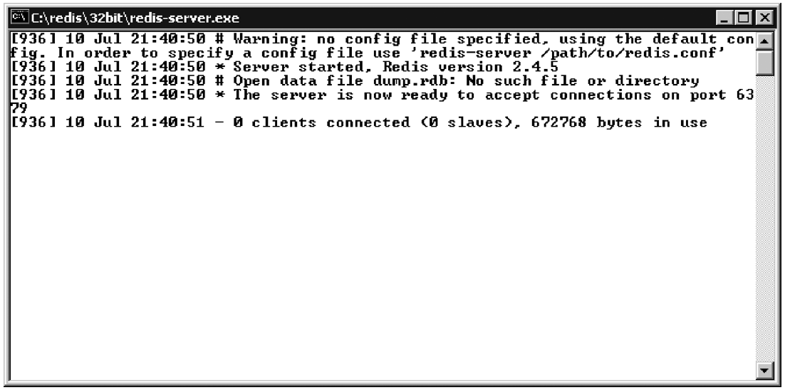

附录A 快速安装指南
=========================

因为在不同平台上面安装Redis的难度和步骤都各不相同，所以这个附录用三节分别介绍了在三种常见的平台上面安装Redis的方法，并说明了安装并配置Python以及Python上面的Redis客户端库的方法，读者可以根据自己使用的平台来决定阅读哪一节。

A.1  在Debian Linux或者Ubuntu Linux上面安装Redis的方法
------------------------------------------------------------

如果读者使用的是Debian衍生的Linux系统，那么第一个想法可能就是使用\ ``apt-get install redis-server``\ 命令来安装Redis，但这种安装方法并不值得推荐，因为根据Debian或者Ubuntu版本的不同，这种安装方法有可能会让读者安装到旧版的Redis。举个例子，在Ubuntu 10.4上面执行\ ``apt-get install redis-server``\ 命令，只会将2010年3月份发布的Redis 1.2.6安装到系统上面，而本书介绍的很多命令都不能在这个旧版本里面执行。

为了避免这一问题，我们需要直接使用源码来编译并安装Redis。本节首先介绍如何安装编译Redis所需的工具，然后再介绍下载、编译和安装Redis的方法。在成功运行Redis之后，本节会说明如何下载Python语言的Redis客户端库。

首先，执行代码清单A-1展示的命令，获取并安装\ ``make``\ 等一系列构建工具。

----

代码清单A-1  在Debian Linux上面安装构建工具

::

    ~$ sudo apt-get update
    ~$ sudo apt-get install make gcc python-dev

----

如果读者的系统已经安装了所需的构建工具，那么上述命令会提示读者相应的工具已经安装过了。在构建工具安装完毕之后，读者需要执行以下操作：

1. 从\ http://redis.io/download\ 下载最新的稳定的Redis源码。

2. 解压源码，编译、安装并启动Redis。

3. 下载并安装Python语言的Redis客户端库。

代码清单A-2展示了前两个操作的执行过程。

----

代码清单A-2  在Linux系统上安装Redis

::

    ~:$ wget -q http://redis.googlecode.com/files/redis-2.6.2.tar.gz    # 从http://redis.io/download下载最新版的Redis。本书写作时Redis的最新版为2.6版本。
    ~:$ tar -xzf redis-2.6.2.tar.gz                                     # 解压源码。
    ~:$ cd redis-2.6.2/
    ~/redis-2.6.2:$ make                                                # 编译Redis。
    cd src && make all                                                  # 注意观察编译消息，
    [trimmed]                                                           # 这里不应该看到错误。
    make[1]: Leaving directory `~/redis-2.6.2/src'                      #
    ~/redis-2.6.2:$ sudo make install                                   # 安装Redis。
    cd src && make install                                              # 注意观察安装消息，
    [trimmed]                                                           # 这里不应该看到错误。
    make[1]: Leaving directory `~/redis-2.6.2/src'                      #
    ~/redis-2.6.2:$ redis-server redis.conf                             # 启动Redis服务器。
    [13792] 26 Aug 17:53:16.523 * Max number of open files set to 10032 # 通过日志确认Redis已经顺利启动。
    [trimmed]                                                           #
    [13792] 26 Aug 17:53:16.529 * The server is now ready to accept     #
    connections on port 6379                                            #

----

在安装并运行Redis之后，读者需要为Python语言安装Redis客户端库。因为最近几年释发布的Ubuntu和Debian都预装了Python 2.6或者2.7，所以读者并不需要花时间去安装Python，不过为了更方便地下载和安装Redis客户端库，读者需要下载并安装一个名为\ ``setuptools``\ 的简单辅助包（simple helper package）\ [#f1]_\ 。代码清单A-3展示了为Python语言安装Redis客户端库的整个过程。

----

代码清单A-3  在Linux上为Python语言安装Redis客户端库

::

    ~:$ wget -q http://peak.telecommunity.com/dist/ez_setup.py          # 下载ez_setup模块
    ~:$ sudo python ez_setup.py                                         # 通过运行ez_setup模块来下载并安装 setuptools。
    Downloading http://pypi.python.org/packages/2.7/s/setuptools/...    #
    [trimmed]                                                           #
    Finished processing dependencies for setuptools==0.6c11             #
    ~:$ sudo python -m easy_install redis hiredis                       # 通过运行setuptools的easy_install包来安装redis包以及hiredis包。
    Searching for redis                                                 # redis包为Python提供了一个连接至Redis的接口。
    [trimmed]                                                           #
    Finished processing dependencies for redis                          #
    Searching for hiredis                                               # hiredis包是一个C库，它可以提高Python的Redis客户端的速度。
    [trimmed]                                                           #
    Finished processing dependencies for hiredis                        #
    ~:$

----

在成功地安装Python的Redis客户端库之后，请跳到本章的A.4节，按照该节介绍的步骤在Python里面对Redis进行测试，为之后在其他章节里面使用Redis做好准备。

A.2  在OS X上面安装Redis的方法
------------------------------------

之前提到过，不同平台下载和安装Redis以及Python的Redis客户端库的方法也各不相同。这一节将讨论：

1. 在OS X系统上下载、安装和运行Redis。

2. 为Python安装Redis客户端库。

在上一节，我们推荐使用Linux系统的读者通过安装构建工具并编译源码的方式来获得可运行的Redis服务器程序。但是在OS X系统上面，Xcode的安装步骤比较复杂，而且Xcode的体积比起Linux上面的构建工具的体积要大10多倍，光是下载Xcode就要花不少时间。因此，本节将介绍不需要用到编译器的Redis安装方法。

为了在不使用编译器的情况下，把Redis安装到OS X上面，我们需要用到一个名为\ *Rudix*\ 的工具，这个工具可以直接以预编译二进制的形式安装各式各样的软件。

为了下载并安装Rudix和Redis，请在OS X的应用程序工具栏里面找到终端程序，然后运行终端并按照代码清单A-4展示的步骤执行Rudix和Redis的安装操作。

----

代码清单A-4  在OS X系统上安装Redis

::

    ~:$ curl -O http://rudix.googlecode.com/hg/Ports/rudix/rudix.py         # 下载用于安装Rudix的引导脚本。
    [trimmed]
    ~:$ sudo python rudix.py install rudix                                  # 命令Rudix安装自身。
    Downloading rudix.googlecode.com/files/rudix-12.6-0.pkg                 # Rudix下载并安装它自身。
    [trimmed]                                                               #
    installer: The install was successful.                                  #
    All done                                                                #
    ~:$ sudo rudix install redis                                            # 命令Rudix安装Redis。
    Downloading rudix.googlecode.com/files/redis-2.4.15-0.pkg               # Rudix下载并安装它自身。
    [trimmed]                                                               #
    installer: The install was successful.                                  #
    All done                                                                #
    ~:$ redis-server                                                        # 启动Redis服务器。
    [699] 13 Jul 21:18:09 # Warning: no config file specified, using the    # Redis使用默认配置启动并运行。
    default config. In order to specify a config file use 'redis-server     #
    /path/to/redis.conf'                                                    #
    [699] 13 Jul 21:18:09 * Server started, Redis version 2.4.15            #
    [699] 13 Jul 21:18:09 * The server is now ready to accept connections   #
    on port 6379                                                            #
    [699] 13 Jul 21:18:09 - 0 clients connected (0 slaves), 922304 bytes    #
    in use                                                                  #

----

在成功安装Redis之后，接下来就该为Python安装Redis客户端库了。因为10.6和10.7版本的OS X都预装了Python 2.6或者Python 2.7，所以我们无需自己去安装Python。因为Redis正在终端的其中一个标签里面运行，所以读者需要按下command + T组合键，创建一个新的标签，然后按照代码清单A-5展示的步骤，在新标签里面执行安装Redis客户端库的操作。

----

代码清单A-5  在OS X系统上为Python安装Redis客户端库

::

    ~:$ sudo rudix install pip                              # 通过Rudix安装名为pip的Python包管理器。
    Downloading rudix.googlecode.com/files/pip-1.1-1.pkg    # Rudix正在安装pip。
    [trimmed]                                               #
    installer: The install was successful.                  #
    All done                                                #
    ~:$ sudo pip install redis                              # 现在可以使用pip来为Python安装Redis客户端库了。
    Downloading/unpacking redis                             # Pip正在为Python安装Redis客户端库。
    [trimmed]                                               #
    Cleaning up...                                          #
    ~:$

----

如果读者把这个附录介绍的在Linux和Windows上面安装Redis的方法也看了的话，就会发现另外两节都是使用\ ``setuptools``\ 的\ ``easy_install``\ 方法来安装Redis客户端库的，只有本节使用的是\ ``pip``\ 。这是因为Rudix提供了\ ``pip``\ 的安装包而没有提供\ ``setuptools``\ 的安装包，因此首先安装\ ``pip``\ ，然后使用\ ``pip``\ 来为Python安装Redis客户端库，要比手动下载并安装\ ``setuptools``\ 简单得多。

另外，如果读者把这个附录介绍的在Linux上面安装Redis的方法也看了的话，就会发现在Linux上面安装Redis客户端的时候，我们把\ ``hiredis``\ 这个辅助库也安装上了，但是在OS X上面我们却没有这么做。这么做的原因和之前没有使用编译方法来安装Redis的原因一样——因为不确定读者是否已经安装了Xcode，所以我们只能基于已有的软件来执行安装操作。

现在读者已经成功地为Python安装了Redis客户端库，接下来可以跳到A.4节，学习如何在Python里面操作Redis了。

A.3  在Windows上安装Redis的方法
-----------------------------------

在学习如何在Windows上面安装Redis之前，读者需要知道，因为种种原因，在Windows上面运行Redis并不值得推荐。本节将介绍以下内容：

- 不推荐在Windows上面运行Redis的原因。
- 如何下载、安装并运行预编译的Windows二进制程序。
- 如何Windows系统上下载并安装Python。
- 如何安装Redis客户端库。

首先来解释一下，为什么读者不应该在Windows系统上运行Redis。

A.3.1  在Windows系统上运行Redis的弊端
^^^^^^^^^^^^^^^^^^^^^^^^^^^^^^^^^^^^^^^^^

Redis在将数据库持久化到磁盘的时候，需要用到\ ``fork``\ 系统调用，而Windows并不支持这个调用。在缺少\ ``fork``\ 调用的情况下，Redis在执行持久化操作期间就只能够阻塞所有客户端，直到持久化操作执行完毕为止。

微软的一些工程师最近花了不少时间来解决Windows版的Redis无法进行后台保存操作的问题，并决定使用线程代替\ ``fork``\ 产生的子进程来对磁盘执行写操作。在写这篇文章的时候，微软开发了Redis 2.6的一个alpha分支，但是这个分支只提供了源码而没有提供预编译二进制文件，并且微软不保证它能否用于生产环境。

在最近一段时间，由Dusan Majkic创建的非官方移植版Redis提供了Redis 2.4.5的预编译二进制文件，但这个版本也会在执行持久化操作时阻塞客户端。

.. note:: 在Windows上面自行编译Redis

    如果读者需要在Windows上面使用最新版本的Redis，那么只能够自己来编译Redis了。编译Redis的最好选择是使用微软官方的移植版本（https://github.com/MSOpenTech/redis/），而编译这个版本需要用到微软的Visual Studio，或者免费的Visual Studio Express 2010。如果读者决定自己编译Redis的话，那么请注意，除了开发和测试之外，微软对这个移植版Redis的健壮性不做任何保证。

在了解了Windows版本的Redis的现状之后，如果读者还是想要在Windows上面安装Redis的话，那么就请看接下来介绍的安装方法吧。

A.3.2  在Windows上安装Redis
^^^^^^^^^^^^^^^^^^^^^^^^^^^^^^^^^^

首先，访问Dusan Majkic的GitHub页面\ https://github.com/dmajkic/redis/downloads\ ，根据你正在使用的Windows版本，下载适用于32位系统或者64位系统的预编译Redis。

在下载完成之后，从下载所得的zip文件里面解压出可执行的文件。因为Windows XP或以上版本的Windows都预装了解压zip文件所需的软件，所以如果你使用的是Windows XP或者以上版本的Windows系统，那么就可以在不安装其他软件的情况下，解压下载所得的zip文件。在将32位或者64位的Redis解压到指定的位置之后，通过双击\ ``redis-server``\ 这个可执行文件来启动Redis服务器（记住，64位的Windows可以执行32位或者64位的Redis，但是32位的Windows只能执行32位的Redis）。在Redis启动之后，你应该会看到类似图A-1所展示的窗口。

----

图A-1  在Windows上运行Redis

----

在成功地运行Redis之后，接下来要做的就是安装Python了。

A.3.3  在Windows上安装Python
^^^^^^^^^^^^^^^^^^^^^^^^^^^^^^^^^^^^

如果你还没有在系统上安装Python 2.6或者Python 2.7，那么你最好下载Python 2.7的最新版本，因为这是Redis客户端支持的最新版Python。首先访问\ http://www.python.org/download/\ ，选择Windows可用的2.7系列的最新版本，然后根据你的系统下载32位或者64位的版本。下载完成之后，通过双击下载所得的.msi文件来进行安装。

在默认情况下，Python 2.7将被安装到C:\Python27\下。接下来要做的就是为Python安装Redis客户端库。注意：如果你使用的是Python 2.6，那么每次书本引用位置\ *Python27*\ 的时候，你都需要将\ *Python27*\ 替换成\ *Python26*\ 。

为了安装Redis客户端库，我们首先需要通过命令行来安装\ ``setuptools``\ 包，然后再通过\ ``setuptools``\ 包安装\ ``easy_install``\ 工具。首先，单击Windows菜单栏上的“开始”按钮，在“附件”程序组里面找到“命令提示符”，然后单击并打开命令提示符程序。在打开命令提示符程序之后，按照代码清单A-6展示的操作，依次下载并安装\ ``setuptools``\ 和Redis客户端库。

----

代码清单A-6  在Windows上为Python安装Redis客户端库

::

    C:\Users\josiah>c:\python27\python                                      # 以交互模式启动Python。
    Python 2.7.3 (default, Apr 10 2012, 23:31:26) [MSC v.1500 32 bit...
    Type "help", "copyright", "credits" or "license" for more information.
    >>> from urllib import urlopen                                          # 从urllib模块里面载入urlopen工厂函数。
    >>> data = urlopen('http://peak.telecommunity.com/dist/ez_setup.py')    # 获取一个能够帮助你安装其他包的模块。
    >>> open('ez_setup.py', 'wb').write(data.read())                        # 将下载后的模块写入磁盘文件里。
    >>> exit()                                                              # 通过执行内置的exit()函数来退出Python解释器。

    C:\Users\josiah>c:\python27\python ez_setup.py                          # 运行ez_setup辅助模块。
    Downloading http://pypi.python.org/packages/2.7/s/setuptools/...        # ez_setup辅助模块会下载并安装setuptools，
    [trimmed]                                                               # 而setuptools可以方便地下载并安装Redis客户端库。
    Finished processing dependencies for setuptools==0.6c11                 #

    C:\Users\josiah>c:\python27\python -m easy_install redis                # 使用setuptools的easy_install模块来下载并安装Redis。
    Searching for redis                                                     #
    [trimmed]                                                               #
    Finished processing dependencies for redis                              #
    C:\Users\josiah>

----

现在你已经成功地安装了Python以及Redis客户端库了，请接着阅读下面的A.4节，学习如何在Python里面使用Redis。

A.4  你好Redis
--------------------

在安装了Redis之后，读者还需要确保Python有合适的库可以访问Redis。如果你是遵照之前说明的步骤来执行安装操作的话，那么你现在应该还打开着一个命令提示符窗口（如果你已经关闭了那个窗口的话，那么请重新打开一个），请在这个命令提示符窗口运行Python，并按照代码清单A-7展示的步骤，在Python控制台里面尝试连接Redis并发送几个命令。

----

代码清单A-7  使用Python来测试Redis

::

    ~:$ python                                          # 启动Python，并使用它来验证Redis的各项功能是否正常。
    Python 2.6.5 (r265:79063, Apr 16 2010, 13:09:56) 
    [GCC 4.4.3] on linux2
    Type "help", "copyright", "credits" or "license" for more information.
    >>> import redis                                    # 导入Redis客户端库，如果系统已经安装了hiredis这个C加速库的话，那么Redis客户端库会自动使用hiredis。
    >>> conn = redis.Redis()                            # 创建一个指向Redis的连接。
    >>> conn.set('hello', 'world')                      # 设置一个值，
    True                                                # 并通过返回值确认设置操作是否执行成功。
    >>> conn.get('hello')                               # 获取刚刚设置的值。
    'world'                                             #

----

.. note:: 以其他方式运行Python

    除了在终端里面运行Python之外，还有很多各式各样功能丰富的Python控制台可以供我们使用。比如Windows和OS X上的Python都附带了一个名为Idle的软件（Linux用户也可以通过安装\ ``idle-python2.6``\ 或者\ ``idle-python2.7``\ 来获得这个软件），只要在命令行中输入\ ``python -m idlelib.idle``\ 就可以启动它。Idle是一个相当基础的编辑器兼控制台，适合于那些刚开始学习编程的人使用，而另外一些人则喜欢使用提供了丰富功能的IPython作为Python的控制台，你可以根据自己的实际情况来选择合适的软件。

.. note:: OS X和Windows的Redis

    目前Windows和OS X使用的预编译Redis都是2.4版本的。因为本书在某些章节里面会用到Redis 2.6或者之后的版本才支持的新特性，所以如果你发现书中的程序不能正常运作，并且你使用的是Redis 2.4，那么有可能这些程序里面用到了Redis 2.6才有的新特性。本书第3章列举了一些需要用到新特性的例子。

.. note:: 配置Redis

    在默认情况下，Redis会根据配置使用快照持久化或者AOF持久化来保存数据，直到客户端发送\ ``SHUTDOWN``\ 命令为止。如果用户在启动Redis时没有指定持久化文件的保存位置，那么持久化文件将会被保存到Redis启动时所使用的路径上面。改变持久化文件的保存路径需要对\ ``redis.conf``\ 文件进行修改，并根据你的平台选用合适的系统启动脚本，另外别忘了把已有的持久化文件移动到配置指定的路径上面。关于配置Redis的更多消息可以参考本书的第4章。

.. note:: hiredis在非Linux平台上是否可用？

    正在使用Windows系统或者OS X系统，但是阅读了Debian/Ubuntu安装步骤的读者可能会发现，在Linux系统上，我们为Python安装了一个名为\ ``hiredis``\ 的库，这个库是一个加速器，它可以将处理协议的工作交给一个C库来完成。尽管这个库可以在Windows和OS X上进行编译，但网上很少有人会提供这个库的二进制版本，所以如果读者想要在Windows或者OS X上编译并使用\ ``hiredis``\ 的话，那么只能靠自己了。

本书的各个章节会时不时地使用Python控制台来展示如何与Redis进行交互，并在本书的正文中展示用Python编写的函数定义和可执行语句。在不使用Python控制台的情况下，我们假设那些在正文中展示的函数定义都位于一个Python模块里面。如果你以前从来没有使用过Python，那么你应该阅读Python的模块教程（\ http://docs.python.org/tutorial/modules.html\ ），从开头直到6.1.1节介绍的所有内容，了解模块的定义以及将模块当作脚本来执行的方法。

如果读者并不熟悉Python，但是能够通过阅读语言文档和教程来了解一门语言的话，那么可以考虑完整地阅读一遍Python语言教程（\ http://docs.python.org/tutorial/\ ）。如果读者只对Python语法和语义中最重要的部分感兴趣，那么可以阅读教程的第3章到第7章，然后再读一下有关生成器的9.10节和9.11节，因为本书会在好几个地方用到生成器。

现在你已经成功地运行了Redis和Python解释器了，如果你是根据本书第1章的引用信息跳到这个附录来的，那么现在你可以掉转头去继续阅读第1章的后续内容了。

如果你在安装Redis或者Python的过程中遇到了困难，那么请到Maning的\ *Redis实战*\ 论坛上发布求助信息，或者查看已有的帖子，看看是否已经有人解决了你遇到的问题。

----

.. [#f1] 有经验的Python用户可能会问，为什么要安装\ ``setuptools``\ 而不是\ ``pip``\ 呢？（\ ``pip``\ 是另一个用于安装Python库的软件包。）这是因为\ ``pip``\ 进行简易下载（easy download）所需的\ ``virtualenv``\ 不在本书介绍的内容范围之内。
