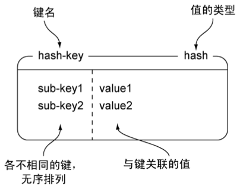
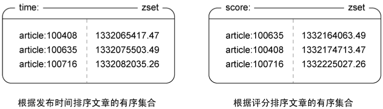
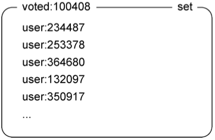
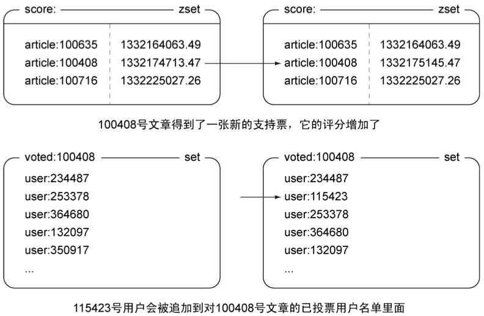

第1章  初识Redis
============================

本章涵盖：

- Redis与其他软件的相同之处和不同之处
- Redis的用法
- 使用Python示例代码与Redis进行简单的互动
- 使用Redis解决实际问题

Redis是一个远程内存数据库，它不仅性能强劲，而且还具有复制特性以及为解决问题而生的独一无二的数据模型。Redis提供了五种不同类型的数据结构，各式各样的问题都可以很自然地映射到这些数据结构上：Redis的数据结构致力于帮助用户解决问题，而不会像其他数据库那样，要求用户扭曲问题来适应数据库。除此之外，通过复制、持久化（persistence）和客户端分片（client-side sharding）等特性，用户可以很方便地将Redis扩展成一个能够包含数百GB数据、每秒钟处理上百万次请求的系统。

我第一次使用Redis是在一家公司里面，这家公司需要对一个客户联系方式数据库进行搜索。搜索需要查找姓名、电子邮件地址、所在地和电话号码。这个系统是用SQL数据库编写的，在60 000个客户中进行查找匹配的一系列查询需要花费10~15秒的时间。在花了一周时间学习Redis的基础知识之后，我使用Redis构建了一个搜索引擎，能够对所有那些字段甚至更多字段进行过滤和排序，并且在50毫秒内返回响应。经过短短几个星期的努力测试，就使这个系统达到了生产级别，性能比原来的系统提高了200倍。阅读本书可以让你学到很多小技巧、小窍门以及一些众所周知的Redis曾经成功解决过的问题。

本章将介绍Redis的适用范围，以及在不同环境中使用Redis的方法（比如怎样跟不同的组件和编程语言进行通信等等）；而之后的章节则会展示各式各样的问题，以及使用Redis来解决这些问题的方法。

现在你已经知道我是怎样开始使用Redis的了，也知道了这本书大概要讲些什么内容了，是时候更详细地介绍一下Redis，并说明为什么应该使用Redis了。

.. note:: 安装Redis和Python

    附录A介绍了快速安装Redis和Python的方法。

.. note:: 在其他编程语言里面使用Redis

    本书只展示了使用Python语言编写的示例代码，使用Ruby、Java和JavaScript（Node.js）编写的示例代码可以在这里找到：https://github.com/josiahcarlson/redis-in-action。使用Spring框架的读者可以通过查看\ http://www.springsource.org/spring-data/redis\ 来学习如何在Spring框架中使用Redis。

1.1  Redis简介
----------------------

前面对于 Redis 数据库的描述只说出了一部分真相。Redis是一个速度非常快的非关系数据库（non-relational database），它可以存储键（key）与5种不同类型的值（value）之间的映射（mapping），可以将存储在内存的键值对数据持久化到硬盘，可以使用复制特性来扩展读性能，还可以使用客户端分片\ [#f1]_\ 来扩展写性能，接下来的几节将分别介绍Redis的这几个特性。

1.1.1  Redis与其他数据库和软件的对比
^^^^^^^^^^^^^^^^^^^^^^^^^^^^^^^^^^^^^^^^^

如果你熟悉关系数据库，那么你肯定写过用来关联两个表的数据的SQL查询。而Redis则属于人们常说的\ *NoSQL*\ 数据库或者\ *非关系*\ 数据库：Redis不使用表，它的数据库也没有预定义或者强制的方式来要求用户关联Redis存储的不同数据。

高性能键值缓存服务器memcached也经常被拿来与Redis进行比较：这两者都可用于存储键值映射，彼此的性能也相差无几，但是Redis能够自动以两种不同的方式将数据写入磁盘，并且Redis除了能存储普通的字符串键之外，还可以存储其他4种数据结构，而memcached只能存储普通的字符串键。这些及其他不同使得Redis可以用于解决更为广泛的问题，既可以作为主数据库（primary database）使用，又可以作为其他存储系统的辅助数据库（auxiliary database）使用。

本书的后续章节会分别介绍将Redis用作主存储（primary storage）和二级存储（secondary storage）时的用法和查询模式。一般来说，许多用户只会在Redis的性能或者功能是必要的情况下，才会将数据存储到Redis里面：如果程序对性能的要求不高，又或者因为费用原因而没办法将大量数据存储到内存里面，那么用户可能会选择使用关系数据库，或者其他非关系数据库。在实际中，读者应该根据自己的需求来决定是否使用Redis，并考虑是将Redis用作主存储还是辅助存储，以及如何通过复制、持久化和事务等手段保证数据的完整性。

表1-1展示了一部分在功能上与Redis有重叠的数据库服务器和缓存服务器，从这个表可以看出Redis与这些数据库及软件之间的区别。

----

表1-1  一些数据库和缓存服务器的特性与功能

+------------+-------------------------------------------+--------------------------------------+-----------------------------------------------------------------+-----------------------------------------+
|     名称   |             类型                          | 数据存储选项                         |                            查询类型                             | 附加功能                                |
+============+===========================================+======================================+=================================================================+=========================================+
| Redis      | 使用内存存储（in-memory） 的非关系数据库  | 字符串、列表、集合、散列表、有序集合 | 每种数据类型都有自己的专属命令，                                |                                         |
|            |                                           |                                      | 另外还有批量操作（bulk operation）和不完全（partial）的事务支持 | 发布与订阅，                            |
|            |                                           |                                      |                                                                 | 主从复制（master/slave replication），  |
|            |                                           |                                      |                                                                 | 持久化，                                |
|            |                                           |                                      |                                                                 | 脚本（存储过程，stored procedure）      |
+------------+-------------------------------------------+--------------------------------------+-----------------------------------------------------------------+-----------------------------------------+
| memcached  | 使用内存存储的键值缓存                    | 键值之间的映射                       | 创建命令、读取命令、更新命令、删除命令以及其他几个命令          | 为提升性能而设的多线程服务器            |
+------------+-------------------------------------------+--------------------------------------+-----------------------------------------------------------------+-----------------------------------------+
| MySQL      | 关系数据库                                | 每个数据库可以包含多个表，           |                                                                 |                                         |
|            |                                           | 每个表可以包含多个行；               |                                                                 |                                         |
|            |                                           | 可以处理多个表的视图（view）；       |                                                                 |                                         |
|            |                                           | 支持空间（spatial）和第三方扩展      | ``SELECT`` 、 ``INSERT`` 、 ``UPDATE`` 、 ``DELETE``            |                                         |
|            |                                           |                                      | 、函数、存储过程                                                | 支持ACID性质（需要使用InnoDB），        |
|            |                                           |                                      |                                                                 | 主从复制和主主复制                      |
|            |                                           |                                      |                                                                 | （master/master replication）           |
+------------+-------------------------------------------+--------------------------------------+-----------------------------------------------------------------+-----------------------------------------+
| PostgreSQL | 关系数据库                                | 每个数据库可以包含多个表，           |                                                                 |                                         |
|            |                                           | 每个表可以包含多个行；               |                                                                 |                                         |
|            |                                           | 可以处理多个表的视图；               |                                                                 |                                         |
|            |                                           | 支持空间和第三方扩展；支持可定制类型 | ``SELECT`` 、 ``INSERT`` 、 ``UPDATE`` 、 ``DELETE``            |                                         |
|            |                                           |                                      | 、内置函数、自定义的存储过程                                    | 支持ACID性质，主从复制，                |
|            |                                           |                                      |                                                                 | 由第三方支持的多主复制                  |
|            |                                           |                                      |                                                                 | （multi-master replication）            |
+------------+-------------------------------------------+--------------------------------------+-----------------------------------------------------------------+-----------------------------------------+
| MongoDB    | 使用硬盘存储（on-disk）的非关系文档存储   | 每个数据库可以包含多个表，           |                                                                 |                                         |
|            |                                           | 每个表可以包含多个无schema           |                                                                 |                                         |
|            |                                           | （schema-less）的BSON文档            | 创建命令、读取命令、更新命令、删除命令、条件查询命令，等等      | 支持map-reduce操作，主从复制，分片，    |
|            |                                           |                                      |                                                                 | 空间索引（spatial index）               |
+------------+-------------------------------------------+--------------------------------------+-----------------------------------------------------------------+-----------------------------------------+

----

1.1.2  附加特性
^^^^^^^^^^^^^^^^^^

在使用类似Redis这样的内存数据库时，一个首先要考虑的问题就是“当服务器被关闭时，服务器存储的数据将何去何从呢？”Redis拥有两种不同形式的持久化方法，它们都可以用小而紧凑的格式将存储在内存中的数据写入到磁盘：第一种持久化方法为时间点转储（point-in-time dump），转储操作既可以在“指定时间段内有指定数量的写操作执行”这一条件被满足时执行，又可以通过调用两条转储到磁盘（dump-to-disk）命令中的任何一条来执行；第二种持久化方法将所有修改了数据库的命令都写入到一个只追加（append-only）文件里面，用户可以根据数据的重要程度，将只追加写入设置为从不同步（sync）、每秒钟同步一次或者每写入一个命令就同步一次。我们将在第4章中更加深入地讨论这些持久化选项。

另外，尽管Redis的性能很好，但受限于Redis的内存存储设计，有时候只使用一台Redis服务器可能没有办法处理所有请求。因此，为了扩展Redis的读性能，并为Redis提供故障转移（failover）支持，Redis实现了主从复制特性：执行复制的从服务器会连接上主服务器，接收主服务器发送的完整数据库的初始副本（copy）；之后主服务器执行的写命令，都会被发送给所有连接着的从服务器去执行，从而实时地更新从服务器的数据集。因为从服务器包含的数据会不断地进行更新，所以客户端可以向任意一个从服务器发送读请求，以此来避免对主服务器进行集中式的访问。我们将在第4章中更加深入地讨论Redis从服务器。

1.1.3  使用Redis的理由
^^^^^^^^^^^^^^^^^^^^^^^^^^

有memcached使用经验的读者可能知道，用户只能用\ ``APPEND``\ 命令将数据添加到已有字符串的末尾。memcached的文档中声明，可以用\ ``APPEND``\ 命令来管理元素列表。这很好！用户可以将元素追加到一个字符串的末尾，并将那个字符串当作列表来使用。但随后如何删除这些元素呢？memcached采用的办法是采用黑名单（blacklist）来隐藏列表里面的元素，从而避免对元素执行读取、更新、写入（或者数据库请求和memcached写入）等操作。相反地，Redis的\ ``LIST``\ 和\ ``SET``\ 允许用户直接添加或者删除元素。

使用Redis代替memcached可以解决这个问题以及其他问题，不仅可以让代码变得更简短、更易懂、更易维护，而且还可以使代码的运行速度更快（因为用户不需要通过读取数据库来更新数据）。除此之外，在其他许多情况下，Redis的效率和易用性也比关系数据库要好得多。

数据库的一个常见用法是存储长期的报告数据，并将这些报告数据用作固定时间范围内的聚合数据（aggregates）。收集聚合数据的常见做法是：先将各个行插入到一个报告表里面，之后再通过扫描这些行来收集聚合数据，并根据收集到的聚合数据来更新聚合表中已有的那些行。之所以使用插入行的方式来存储，是因为对于大部分数据库来说，插入行操作的执行速度非常快（插入行只会在磁盘文件末尾进行写入）。不过，对表里面的行进行更新却是一个速度相当慢的操作，因为这种更新除了会引起一次随机读（random read）之外，还可能会引起一次随机写（random write）。而在Redis里面，用户可以直接使用原子的（atomic）\ ``INCR``\ 命令及其变种来计算聚合数据，并且因为Redis将数据存储在内存里面\ [#f2]_\ ，而且发送给Redis的命令请求并不需要经过典型的查询分析器（parser）或者查询优化器（optimizer）进行处理，所以对Redis存储的数据执行随机写的速度总是非常快。

使用Redis而不是关系数据库或者其他磁盘存储数据库，可以避免写入不必要的临时数据，也免去了对临时数据进行扫描或者删除的麻烦，并最终改善程序的性能。虽然上面列举的都是一些简单的例子，但它们很好地证明了“工具会极大地改变人们解决问题的方式”这一点。

除了第6章提到的任务队列（task queue）之外，本书的大部分内容都致力于实时地解决问题。本书通过展示各种技术并提供可工作的代码来帮助读者消灭瓶颈、简化代码、收集数据、分发（distribute）数据、构建实用程序（utility），并最终帮助读者更轻松地完成构建软件的任务。只要正确地使用书中介绍的技术，读者的软件就可以扩展至令那些所谓的“Web扩展技术（web-sacle technology）”相形见拙的地步。

在了解了Redis是什么、它能做什么以及我们为什么要使用它之后，是时候来实际地使用一下它了。接下来的一节将对Redis提供的数据结构进行介绍，说明这些数据结构的作用，并展示一部分操作这些数据结构的命令。

1.2  Redis数据结构简介
----------------------------

正如之前的表1-1所示，Redis可以存储键与5种不同数据结构类型之间的映射，这5种数据结构类型分别为\ ``STRING``\ （字符串）、\ ``LIST``\ （列表）、\ ``SET``\ （集合）、\ ``HASH``\ （散列）和\ ``ZSET``\ （有序集合）。有一部分Redis命令对于这5种结构都是通用的：比如\ ``DEL``\ 、\ ``TYPE``\ 、\ ``RENAME``\ 等等；但也有一部分Redis命令只能对特定的一种或者两种结构使用，第3章将对Redis提供的命令进行更深入的介绍。

大部分程序员应该都不会对Redis的\ ``STRING``\ 、\ ``LIST``\ 、\ ``HASH``\ 这3种结构感到陌生，因为它们和很多编程语言内建的字符串、列表和散列等结构在实现和语义（semantics）方面都非常相似。有些编程语言还有集合数据结构，在实现和语义上类似于Redis的\ ``SET``\ 。\ ``ZSET``\ 在某种程度上是一种Redis特有的结构，但是当你熟悉了它之后，就会发现它也是一种非常有用的结构。表1-2对比了Redis提供的5种结构，说明了这些结构存储的值，并简单介绍了它们的语义。

----

表1-2  Redis提供的5种结构

+---------------------------+---------------------------------------------------------------------------------------------------+---------------------------------------------------------------------------+
| 结构类型                  |                           结构存储的值                                                            |                           结构的读写能力                                  |
+===========================+===================================================================================================+===========================================================================+
| ``STRING``                | 可以是字符串、整数或者浮点数                                                                      | 对整个字符串或者字符串的其中一部分执行操作；                              |
|                           |                                                                                                   | 对整数和浮点数执行自增（increment）或者自减（decrement）操作              |
+---------------------------+---------------------------------------------------------------------------------------------------+---------------------------------------------------------------------------+
| ``LIST``                  | 一个链表，链表上的每个节点都包含了一个字符串                                                      | 从链表的两端推入或者弹出元素；根据偏移量对链表进行修剪（trim）；          |
|                           |                                                                                                   | 读取单个或者多个元素；根据值查找或者移除元素                              |
+---------------------------+---------------------------------------------------------------------------------------------------+---------------------------------------------------------------------------+
| ``SET``                   | 包含字符串的无序收集器（unordered collection），并且被包含的每个字符串都是独一无二、各不相同的    | 添加、获取、移除单个元素；检查一个元素是否存在于集合中；                  |
|                           |                                                                                                   | 计算交集、并集、差集；从集合里面随机获取元素                              |
+---------------------------+---------------------------------------------------------------------------------------------------+---------------------------------------------------------------------------+
| ``HASH``                  | 包含键值对的无序散列表                                                                            | 添加、获取、移除单个键值对；获取所有键值对                                |
+---------------------------+---------------------------------------------------------------------------------------------------+---------------------------------------------------------------------------+
| ``ZSET`` （有序集合）     | 字符串成员（member）与浮点数分值（score）之间的有序映射，元素的排列顺序由分值的大小决定           | 添加、获取、删除单个元素；根据分值范围（range）或者成员来获取元素         |
+---------------------------+---------------------------------------------------------------------------------------------------+---------------------------------------------------------------------------+

----

.. note:: 命令列表

    本节在介绍每个数据类型的时候，都会在一个表格里面展示一小部分处理这些数据结构的命令，之后的第3章会展示一个更详细（但仍不完整）的命令列表，完整的Redis命令列表可以在\ http://redis.io/commands\ 找到。

这一节将介绍如何表示Redis的这5种结构，并且还会介绍Redis命令的使用方法，从而为本书的后续内容打好基础。本书展示的所有示例代码都是用Python写的，如果读者已经按照附录A里面描述的方法安装好了Redis，那么应该也已经安装好了Python，以及在Python里面使用Redis所需的客户端库。只要读者在电脑里面安装了Redis、Python和redis-py库，就可以在阅读本书的同时，尝试执行书中展示的示例代码了。

.. note:: 请安装Redis和Python

    在阅读后续内容之前，请读者先按照附录A中介绍的方法安装Redis和Python。如果读者觉得附录A描述的安装方法过于复杂，那么这里有一个更简单的方法，但这个方法只能用于Debian系统（或者该系统的衍生系统）：从\ http://redis.io/download\ 下载Redis的压缩包，解压压缩包，执行\ ``make && sudo make install``\ ， 之后再执行\ ``sudo python -m easy_install redis hiredis``\ （\ *hiredis*\ 是可选的，它是一个使用C语言编写的高性能Redis客户端）。

如果读者熟悉过程式编程语言或者面向对象编程语言，那么即使没有使用过Python，应该也可以看懂Python代码。另一方面，如果读者决定使用其他编程语言来操作Redis，那么就需要自己来将本书的Python代码翻译成正在使用的语言的代码。

.. note:: 使用其他语言编写的示例代码

    尽管没有包含在书中，但本书展示的Python示例代码已经被翻译成了Ruby代码、Java代码和JavaScript代码，这些翻译代码可以在\ https://github.com/josiahcarlson/redis-in-action\ 下载到。跟Python编写的示例代码一样，这些翻译代码也包含相应的注释，方便读者参考。

为了让示例代码尽可能地简单，本书会尽量避免使用Python的高级特性，并使用函数而不是类或者其他东西来执行Redis操作，以此来将焦点放在使用Redis解决问题上面，而不必过多地关注Python的语法。本节将使用redis-cli控制台与Redis进行互动。首先，让我们来了解一下Redis中最简单的结构：\ ``STRING``\ 。

1.2.1  Redis中的字符串
^^^^^^^^^^^^^^^^^^^^^^^^^^^^

Redis的\ ``STRING``\ 和其他编程语言或者其他键值存储提供的字符串非常相似。本书在使用图片表示键和值的时候，通常会将键名（key name）和值的类型放在方框的顶部，将值放在方框的里面。图1-1以键为\ ``hello``\ 、值为\ ``world``\ 的\ ``STRING``\ 为例，分别标记了方框的各个部分。

----

.. image:: image/1-1.png

图1-1  一个\ ``STRING``\ 示例，键为\ ``hello``\ ，值为\ ``world``

----

``STRING``\ 拥有一些和其他键值存储相似的命令，比如\ ``GET``\ （获得值）、\ ``SET``\ （设置值）和\ ``DEL``\ （删除值）。如果读者已经按照附录A的方法安装测试了Redis，那么可以根据代码清单1-1展示的例子，尝试使用redis-cli执行\ ``SET``\ 、\ ``GET``\ 和\ ``DEL``\ ，表1-3描述了这三个命令的基本用法。

----

表1-3  字符串命令

+-----------+-----------------------------------------------------+
| 命令      |           行为                                      |
+===========+=====================================================+
| ``GET``   | 获取存储在给定键中的值                              |
+-----------+-----------------------------------------------------+
| ``SET``   | 设置存储在给定键中的值                              |
+-----------+-----------------------------------------------------+
| ``DEL``   | 删除存储在给定键中的值（这个命令可以用于所有类型）  |
+-----------+-----------------------------------------------------+

----

代码清单1-1  ``SET``\ 、\ ``GET``\ 和\ ``DEL``\ 的使用示例

::

    $ redis-cli                                 # 启动redis-cli 客户端
    redis 127.0.0.1:6379> set hello world       # 将键 hello 的值设置为 world 。
    OK                                          # SET 命令在执行成功时返回 OK ，Python 客户端会将这个 OK 转换成 True
    redis 127.0.0.1:6379> get hello             # 获取储存在键 hello 中的值。
    "world"                                     # 键的值仍然是 world ，跟我们刚才设置的一样。
    redis 127.0.0.1:6379> del hello             # 删除这个键值对。
    (integer) 1                                 # 在对值进行删除的时候，DEL 命令将返回被成功删除的值的数量。
    redis 127.0.0.1:6379> get hello             # 因为键的值已经不存在，所以尝试获取键的值将得到一个 nil ，
    (nil)                                       # Python 客户端会将这个 nil 转换成 None。
    redis 127.0.0.1:6379> 
    
----

.. note:: 使用redis-cli

    为了让读者在一开始就能便捷地与Redis进行交互，本章将使用\ *redis-cli*\ 这个交互式客户端来介绍Redis命令。

除了能够\ ``GET``\ 、\ ``SET``\ 和\ ``DEL``\ 字符串值之外，还有一些可以对字符串的其中一部分内容进行读取和写入的命令，以及一些能对字符串存储的数值执行自增或者自减操作的命令。第3章将对这些命令进行介绍，但是在此之前，我们还有许多基础知识需要了解，下面来看一下Redis的列表及其功能。

1.2.2  Redis中的列表
^^^^^^^^^^^^^^^^^^^^^^^^

Redis对链表（linked-list）结构的支持使得它在键值存储的世界中独树一帜。一个列表结构可以有序地存储多个字符串，和表示字符串时使用的方法一样，本节使用带有标签的方框来表示列表，并将列表包含的元素放在方框里面。图1-2展示了一个这样的示例。

----

.. image:: image/1-2.png

图1-2  ``list-key``\ 是一个包含三个元素的列表键，注意列表里面的元素是可以重复的

----

Redis列表可执行的操作和很多编程语言里面的列表操作非常相似：\ ``LPUSH``\ 命令和\ ``RPUSH``\ 命令分别用于将元素推入到列表的左端（left end）和右端（right end）；\ ``LPOP``\ 命令和\ ``RPOP``\ 命令分别用于从列表的左端和右端弹出元素；\ ``LINDEX``\ 命令用于获取列表在给定位置上的一个元素；\ ``LRANGE``\ 命令用于获取列表在给定范围上的所有元素。代码清单1-2展示了一些列表命令的使用示例，表1-4简单介绍了示例中用到的各个命令。

----

表1-4  列表命令

+---------------+-------------------------------------------+
|   命令        |                行为                       |
+===============+===========================================+
| ``RPUSH``     | 将给定值推入到列表的右端                  |
+---------------+-------------------------------------------+
| ``LRANGE``    | 获取列表在给定范围上的所有值              |
+---------------+-------------------------------------------+
| ``LINDEX``    | 获取列表在给定位置上的单个元素            |
+---------------+-------------------------------------------+
| ``LPOP``      | 从列表的左端弹出一个值，并返回被弹出的值  |
+---------------+-------------------------------------------+

----

代码清单1-2  ``RPUSH``\ 、\ ``LRANGE``\ 、\ ``LINDEX``\ 和\ ``LPOP``\ 的使用示例

::

    redis 127.0.0.1:6379> rpush list-key item   # 在向列表推入新元素之后，该命令会返回列表的当前长度。
    (integer) 1                                 #
    redis 127.0.0.1:6379> rpush list-key item2  #
    (integer) 2                                 #
    redis 127.0.0.1:6379> rpush list-key item   #
    (integer) 3                                 #
    redis 127.0.0.1:6379> lrange list-key 0 -1  # 使用0为范围的起始索引，-1为范围的结束索引，
    1) "item"                                   # 可以取出列表包含的所有元素。
    2) "item2"                                  #
    3) "item"                                   #
    redis 127.0.0.1:6379> lindex list-key 1     # 使用LINDEX可以从列表里面取出单个元素。
    "item2"                                     #
    redis 127.0.0.1:6379> lpop list-key         # 从列表里面弹出一个元素，被弹出的元素不再存在于列表。
    "item"                                      #
    redis 127.0.0.1:6379> lrange list-key 0 -1  #
    1) "item2"                                  #
    2) "item"                                   #
    redis 127.0.0.1:6379> 

----

即使Redis的列表只支持以上提到的几个命令，它也已经可以用来解决很多问题了，但Redis并没有就此止步——除了上面提到的命令之外，Redis列表还拥有从列表里面移除元素的命令、将元素插入到列表中间的命令、将列表修剪至指定长度（相当于从列表的其中一端或者两端移除元素）的命令，以及其他一些命令。第3章将介绍许多列表命令，但是在此之前，让我们先来了解一下Redis的集合。

1.2.3  Redis的集合
^^^^^^^^^^^^^^^^^^^^^^^^^^^^

Redis的集合和列表都可以存储多个字符串，它们之间的不同在于，列表可以存储多个相同的字符串，而集合则通过使用散列表来保证自己存储的每个字符串都是各不相同的（这些散列表只有键，但没有与键相关联的值）。本书表示集合的方法和表示列表的方法基本相同，图1-3展示了一个包含三个元素的示例集合。

----

.. image:: image/1-3.png

图1-3  ``set-key``\ 是一个包含三个元素的集合键

----

因为Redis的集合使用无序（unordered）方式存储元素，所以用户不能像使用列表那样，将元素推入到集合的某一端，或者从集合的某一端弹出元素。不过用户可以使用\ ``SADD``\ 命令将元素添加到集合，或者使用\ ``SRAM``\ 命令从集合里面移除元素。另外，还使用\ ``SISMEMBER``\ 命令快速地检查一个元素是否已经存在于集合中，或者使用\ ``SMEMBERS``\ 命令获取集合包含的所有元素（如果集合包含的元素非常多，那么\ ``SMEMBERS``\ 命令的执行速度可能会很慢，所以请谨慎地使用这个命令）。代码清单1-3展示了一些集合命令的使用示例，表1-5简单介绍了代码清单里面用到的各个命令。

----

表1-5  集合命令

+---------------+-----------------------------------------------+
|    命令       |           行为                                |
+===============+===============================================+
| ``SADD``      | 将给定元素添加到集合                          |
+---------------+-----------------------------------------------+
| ``SMEMBERS``  | 返回集合包含的所有元素                        |
+---------------+-----------------------------------------------+
| ``SISMEMBER`` | 检查给定元素是否存在于集合中                  |
+---------------+-----------------------------------------------+
| ``SREM``      | 如果给定的元素存在于集合中，那么移除这个元素  |
+---------------+-----------------------------------------------+

----

代码清单1-3  ``SADD``\ 、\ ``SMEMBERS``\ 、\ ``SISMEMBER``\ 和\ ``SREM``\ 的使用示例

::

    redis 127.0.0.1:6379> sadd set-key item     # 在尝试将一个元素添加到集合的时候，
    (integer) 1                                 # 命令返回1表示这个元素被成功地添加到了集合里面，
    redis 127.0.0.1:6379> sadd set-key item2    # 而返回0则表示这个元素已经存在于集合中。
    (integer) 1                                 #
    redis 127.0.0.1:6379> sadd set-key item3    #
    (integer) 1                                 #
    redis 127.0.0.1:6379> sadd set-key item     #
    (integer) 0                                 #
    redis 127.0.0.1:6379> smembers set-key      # 获取集合包含的所有元素将得到一个由元素组成的序列，
    1) "item"                                   # Python客户端会将这个序列转换成Python集合。
    2) "item2"                                  #
    3) "item3"                                  #
    redis 127.0.0.1:6379> sismember set-key item4   # 检查一个元素是否存在于集合中，
    (integer) 0                                     # Python客户端会返回一个布尔值来表示检查结果。
    redis 127.0.0.1:6379> sismember set-key item    #
    (integer) 1                                     #
    redis 127.0.0.1:6379> srem set-key item2    # 在使用命令移除集合中的元素时，命令会返回被移除的元素数量。
    (integer) 1                                 #
    redis 127.0.0.1:6379> srem set-key item2    #
    (integer) 0                                 #
    redis 127.0.0.1:6379>  smembers set-key
    1) "item"
    2) "item3"
    redis 127.0.0.1:6379> 

----

跟字符串和列表不一样，集合除了基本的添加操作和移除操作之外，还支持很多其他操作，比如\ ``SINTER``\ 、\ ``SUNION``\ 、\ ``SDIFF``\ 三个命令就可以分别执行常见的交集计算、并集计算和差集计算。第3章将对集合的相关命令进行更详细的介绍，另外第7章还会展示如何使用集合来解决多个问题。不过别心急，因为在Redis提供的5种数据结构中，还有两种我们尚未了解，让我们先来看看Redis的散列。

1.2.4  Redis的散列
^^^^^^^^^^^^^^^^^^^^^^^^^^^

Redis的散列可以存储多个键值对之间的映射。和字符串一样，散列存储的值既可以是字符串又可以是数字值，并且用户同样可以对散列存储的数字值执行自增操作或者自减操作。图1-4展示了一个包含两个键值对的散列。

----

图1-4 ``hash-key``\ 是一个包含两个键值对的散列键

----

散列在很多方面就像是一个微缩版的Redis，好几个字符串命令都有相应的散列版本。代码清单1-4展示了怎样对散列执行插入元素、获取元素和移除元素等操作，表1-6简单介绍了代码清单里面用到的各个命令。

----

表1-6  散列命令

+---------------+-------------------------------------------+
|   命令        |           行为                            |
+===============+===========================================+
| ``HSET``      | 在散列里面关联起给定的键值对              |
+---------------+-------------------------------------------+
| ``HGET``      | 获取指定散列键的值                        |
+---------------+-------------------------------------------+
| ``HGETALL``   | 获取散列包含的所有键值对                  |
+---------------+-------------------------------------------+
| ``HDEL``      | 如果给定键存在于散列里面，那么移除这个键  |
+---------------+-------------------------------------------+

----

代码清单1-4  ``HSET``\ 、\ ``HGET``\ 、\ ``HGETALL``\ 和\ ``HDEL``\ 的使用示例

::

    redis 127.0.0.1:6379> hset hash-key sub-key1 value1 # 在尝试添加键值对到散列的时候，
    (integer) 1                                         # 命令会返回一个值来表示给定的键是否已经存在于散列里面。
    redis 127.0.0.1:6379> hset hash-key sub-key2 value2 #
    (integer) 1                                         #
    redis 127.0.0.1:6379> hset hash-key sub-key1 value1 #
    (integer) 0                                         #
    redis 127.0.0.1:6379> hgetall hash-key              # 获取散列包含的所有键值对，
    1) "sub-key1"                                       # Python客户端会将这些键值对转换为Python字典。
    2) "value1"                                         #
    3) "sub-key2"                                       #
    4) "value2"                                         #
    redis 127.0.0.1:6379> hdel hash-key sub-key2        # 在删除键值对的时候，
    (integer) 1                                         # 命令会返回一个值来表示给定的键在移除之前是否存在于散列里面。
    redis 127.0.0.1:6379> hdel hash-key sub-key2        #
    (integer) 0                                         #
    redis 127.0.0.1:6379> hget hash-key sub-key1        # 从散列里面单独取出一个域。
    "value1"                                            #
    redis 127.0.0.1:6379> hgetall hash-key
    1) "sub-key1"
    2) "value1"

----

熟悉文档存储的读者可以将Redis的散列看作是文档存储里面的\ *文档*\ ，而熟悉关系数据库的读者则可以将Redis的散列看作是关系数据库里面的\ *行*\ ，因为散列、文档和行这三者都允许用户同时访问或者修改一个或多个域（field）。最后，让我们来了解一下Redis的5种数据结构中的最后一种：有序集合。

1.2.5  Redis的有序集合
^^^^^^^^^^^^^^^^^^^^^^^^^^^^^^

有序集合和散列一样，都用于存储键值对：其中有序集合的每个键称为\ *成员*\ （member），都是独一无二的，而有序集合的每个值称为\ *分值*\ （score），都必须是浮点数。有序集合是Redis里面唯一既可以根据成员访问元素（这一点和散列一样），又可以根据分值以及分值的排列顺序来访问元素的结构。图1-5展示了一个包含两个元素的有序集合示例。

----

.. image:: image/1-5.png

图 1-5  ``zset-key``\ 是一个包含两个元素的有序集合键

----

和Redis的其他结构一样，用户可以对有序集合执行添加、移除和获取等操作，代码清单1-5展示了这些操作的执行示例，表1-7简单介绍了代码清单里面用到的各个命令。

----

表1-7  有序集合命令

+-------------------+---------------------------------------------------------------+
|      命令         |                行为                                           |
+===================+===============================================================+
| ``ZADD``          | 将一个带有给定分值的成员添加到有序集合里面                    |
+-------------------+---------------------------------------------------------------+
| ``ZRANGE``        | 根据分值的排序顺序，获取有序集合在给定位置范围内的所有元素    |
+-------------------+---------------------------------------------------------------+
| ``ZRANGEBYSCORE`` | 获取有序集合在给定分值范围内的所有元素                        |
+-------------------+---------------------------------------------------------------+
| ``ZREM``          | 如果给定成员存在于有序集合，那么移除这个成员                  |
+-------------------+---------------------------------------------------------------+

----

代码清单1-5  ``ZADD``\ 、\ ``ZRANGE``\ 、\ ``ZRANGEBYSCORE``\ 和\ ``ZREM``\ 的使用示例

::

    redis 127.0.0.1:6379> zadd zset-key 728 member1     # 在尝试向有序集合添加元素的时候，
    (integer) 1                                         # 命令会返回新添加元素的数量。
    redis 127.0.0.1:6379> zadd zset-key 982 member0     #
    (integer) 1                                         #
    redis 127.0.0.1:6379> zadd zset-key 982 member0     #
    (integer) 0                                         #
    redis 127.0.0.1:6379> zrange zset-key 0 -1 withscores   # 获取有序集合包含的所有元素，
    1) "member1"                                            # 这些元素会按照分值进行排序，
    2) "728"                                                # Python客户端会将这些分值转换成浮点数。
    3) "member0"                                            #
    4) "982"                                                #
    redis 127.0.0.1:6379> zrangebyscore zset-key 0 800 withscores   # 也可以根据分值来获取有序集合的其中一部分元素。
    1) "member1"                                                    #
    2) "728"                                                        #
    redis 127.0.0.1:6379> zrem zset-key member1     # 在移除有序集合元素的时候，
    (integer) 1                                     # 命令会返回被移除元素的数量。
    redis 127.0.0.1:6379> zrem zset-key member1     #
    (integer) 0                                     #
    redis 127.0.0.1:6379> zrange zset-key 0 -1 withscores
    1) "member0"
    2) "982"

----

现在读者应该已经知道有序集合是什么和它能干什么了，到此为止，我们基本了解了Redis提供的5种结构。接下来的一节将展示如何通过结合散列的数据存储能力和有序集合内建的排序能力来解决一个常见的问题。

1.3  Redis，你好！
-----------------------------

读者已经基本了解过Redis提供的5种结构了，现在是时候学习一下怎样使用这些结构来解决实际问题了。最近几年，越来越多的网站开始提供对网页链接、文章或者问题进行投票的功能，其中包括图1-6展示的reddit以及图1-7展示的StackOverflow。这些网站会根据文章的发布时间和文章获得的投票数量计算出一个评分，然后按照这个评分来决定如何排序和展示文章。本节将展示如何使用Redis来构建一个简单的文章投票网站的后端。

----

图1-6  Reddit是一个可以对文章进行投票的网站

----

.. image:: image/1-7.png

图1-7  StackOverflow是一个可以对问题进行投票的网站

----

1.3.1  对文章进行投票
^^^^^^^^^^^^^^^^^^^^^^^^^^^^

为了构建这个文章投票网站，我们需要为它预设一些数值和限制：如果一篇文章获得了至少200张支持票（up vote），那么我们认为这篇文章是有趣的；我们假设网站每天发布1 000篇文章，并且其中的50篇符合我们对有趣文章的要求，而我们要做的就是将这50篇有趣的文章放在网站文章列表前100位至少一天；另外，这个网站暂时不提供投反对票（down vote）的功能。

为了产生一个能够随着时间流逝而不断减少的评分，程序需要根据文章的发布时间和当前时间来计算文章的评分，具体的计算方法为：将文章得到的支持票数量乘以一个常数，然后加上文章的发布时间，得出的结果就是文章的评分。

我们使用从UTC时区1970年1月1日到现在为止经过的秒数来计算文章的评分，这个值通常被称为\ *Unix时间*\ 。之所以选择使用Unix时间，是因为在所有能够运行Redis的平台上面，使用编程语言获取这个值都是一件非常简单的事情。另外，计算评分时与支持票数量相乘的常量为432，这个常量是通过将一天的秒数（86 400）除以文章展示一天所需的支持票数量（200）得出的：文章每获得一张支持票，程序就需要将文章的评分增加432分。

构建文章投票网站除了需要计算文章评分之外，还需要使用Redis结构保存网站上的各种信息。对于网站里的每篇文章，程序都使用一个散列来存储文章的标题、指向文章的网址、发布文章的用户、文章的发布时间、文章得到的投票数量等信息，图1-8展示了一个使用散列来存储文章信息的例子。

----

.. image:: image/1-8.png

图1-8  一个使用散列存储文章信息的例子

----

.. note:: 使用冒号作为分隔符

    本书使用冒号（\ ``:``\ ）来分隔名字的不同部分：比如图1-8里面的键名\ ``article:92617``\ 就使用了冒号来分隔单词\ ``article``\ 和文章的ID号\ ``92617``\ ，以此来构建命名空间（namespace）。使用\ ``:``\ 作为分隔符只是我的个人喜好，不过大部分Redis用户也都是这么做的，另外还有一些常见的分隔符，如句号（\ ``.``\ ）、斜线（\ ``/``\ ），甚至还有用人用管道符号（\ ``|``\ ）。无论使用哪个符号来做分隔符，都要保持分隔符的一致性。同时，请读者注意观察和学习本书使用冒号创建嵌套命名空间的方法。

网站使用了两个有序集合来有序地保存文章：第一个有序集合的成员为文章ID，分值为文章的发布时间；另一个有序集合的成员同样为文章ID，而分值则为文章的评分。通过这两个有序集合，网站既可以根据文章发布的先后顺序来展示文章，又可以根据文章评分的高低来展示文章，图1-9展示了这两个有序集合的一个示例。

----

图1-9  两个有序集合分别记录了根据发布时间排序的文章和根据评分排序的文章

----

为了防止用户对同一篇文章进行多次投票，网站需要为每篇文章记录一个已投票用户名单。为此，程序将为每篇文章创建一个集合，并使用这个集合来存储所有已投票用户的ID，图1-10展示了一个这样的集合示例。

----

图1-10  为100408号文章投过票的一部分用户

----

为了尽量节约内存，我们规定当一篇文章发布期满一周之后，用户将不能再对它进行投票，文章的评分将被固定下来，而记录文章已投票用户名单的集合也会被删除。

在实现投票功能之前，让我们来看看图1-11：这幅图展示了当115423号用户给100408号文章投票的时候，数据结构发生的变化。

----

图1-11  当115423号用户给100408号文章投票的时候，数据结构发生的变化

----

我们已经知道了网站计算文章评分的方法，也知道了网站存储数据所使用的数据结构，现在是时候来实现投票功能了！当用户尝试对一篇文章进行投票时，程序需要使用\ ``ZSCORE``\ 命令检查记录文章发布时间的有序集合，判断文章的发布时间是否未超过一周。如果文章仍然处于可以投票的时间范围之内，那么程序将使用\ ``SADD``\ 命令，尝试将用户添加到记录文章已投票用户名单的集合里面。如果添加操作执行成功的话，那么说明用户是第一次对这篇文章进行投票，程序将使用\ ``ZINCRBY``\ 命令（\ ``ZINCRBY``\ 用于对有序集合成员的分值执行自增操作）为文章的评分增加432分，并使用\ ``HINCRBY``\ 命令（\ ``HINCRBY``\ 用于对散列存储的值执行自增操作）对散列记录的文章投票数量进行更新，代码清单1-6展示了投票功能的实现代码。

----

代码清单1-6  ``article_vote()``\ 函数

::

    # 准备好需要用到的常量。
    ONE_WEEK_IN_SECONDS = 7 * 86400
    VOTE_SCORE = 432

    def article_vote(conn, user, article):

        # 计算文章的投票截止时间。
        cutoff = time.time() - ONE_WEEK_IN_SECONDS

        # 检查是否还可以对文章进行投票
        #（虽然使用散列也可以获取文章的发布时间，
        # 但有序集合返回的文章发布时间为浮点数，
        # 可以不进行转换直接使用）。
        if conn.zscore('time:', article) < cutoff:
            return

        # 从article:id标识符（identifier）里面取出文章的ID。
        article_id = article.partition(':')[-1]

        # 如果用户是第一次为这篇文章投票，那么增加这篇文章的投票数量和评分。
        if conn.sadd('voted:' + article_id, user):
            conn.zincrby('score:', article, VOTE_SCORE)
            conn.hincrby(article, 'votes', 1)

----

.. note:: Redis事务

    从技术上来讲，要正确地实现投票功能，我们需要将代码清单1-6里面的\ ``SADD``\ 、\ ``ZINCRBY``\ 和\ ``HINCRBY``\ 三个命令放到一个事务里面执行，不过因为本书要等到第4章才介绍Redis事务，所以我们暂时忽略这个问题。

投票功能还是不错的，对吧？那么发布文章的功能要怎么实现呢？

1.3.2  发布并获取文章
^^^^^^^^^^^^^^^^^^^^^^^^^

发布一篇新文章首先需要创建一个新的文章ID，这项工作可以通过对一个计数器（counter）执行\ ``INCR``\ 命令来完成。接着程序需要使用\ ``SADD``\ 将文章发布者的ID添加到记录文章已投票用户名单的集合里面，并使用\ ``EXPIRE``\ 命令为这个集合设置一个过期时间，让Redis在文章发布期满一周之后自动删除这个集合。之后，程序会使用\ ``HMSET``\ 命令来存储文章的相关信息，并执行两个\ ``ZADD``\ 命令，将文章的初始评分（initial score）和发布时间分别添加到两个相应的有序集合里面。代码清单1-7展示了发布新文章功能的实现代码。

----

代码清单1-7  ``post_article()``\ 函数

::

    def post_article(conn, user, title, link):
        # 生成一个新的文章ID。
        article_id = str(conn.incr('article:'))

        voted = 'voted:' + article_id
        # 将发布文章的用户添加到文章的已投票用户名单里面，
        # 然后将这个名单的过期时间设置为一周（第3章将对过期时间作更详细的介绍）。
        conn.sadd(voted, user)
        conn.expire(voted, ONE_WEEK_IN_SECONDS)

        now = time.time()
        article = 'article:' + article_id
        # 将文章信息存储到一个散列里面。
        conn.hmset(article, {
            'title': title,
            'link': link,
            'poster': user,
            'time': now,
            'votes': 1,
        })

        # 将文章添加到根据发布时间排序的有序集合和根据评分排序的有序集合里面。
        conn.zadd('score:', article, now + VOTE_SCORE)
        conn.zadd('time:', article, now) 

        return article_id

----

好了，我们已经陆续实现了文章投票功能和文章发布功能，接下来要考虑的就是如何取出评分最高的文章以及如何取出最新发布的文章了。为了实现这两个功能，程序需要先使用\ ``ZREVRANGE``\ 命令取出多个文章ID，然后再对每个文章ID执行一次\ ``HGETALL``\ 命令来取出文章的详细信息，这个方法既可以用于取出评分最高的文章，又可以用于取出最新发布的文章。这里特别要注意的一点是，因为有序集合会根据成员的分值从小到大地排列元素，所以使用\ ``ZREVRANGE``\ 命令来按照分值从大到小地取出文章ID才是正确的做法，代码清单1-8展示了文章获取功能的实现函数。

----

代码清单1-8  ``get_articles()``\ 函数

::

    ARTICLES_PER_PAGE = 25

    def get_articles(conn, page, order='score:'):
        # 设置获取文章的起始索引和结束索引。
        start = (page-1) * ARTICLES_PER_PAGE
        end = start + ARTICLES_PER_PAGE - 1

        # 获取多个文章ID。
        ids = conn.zrevrange(order, start, end)
        articles = []
        # 根据文章ID获取文章的详细信息。
        for id in ids:
            article_data = conn.hgetall(id)
            article_data['id'] = id
            articles.append(article_data)

        return articles

----

.. note:: Python的默认值参数和关键字参数

    代码清单1-8中的\ ``get_articles()``\ 函数为\ ``order``\ 参数设置了默认值\ ``score:``\ 。Python语言的初学者可能会对“默认值参数”以及“根据名字（而不是位置）来传入参数”的一些细节感到陌生。如果读者在理解函数定义或者参数传递方面有困难，那么可以参考Python入门指南，里面对这两个方面进行了很好的介绍，可以通过以下短地址直接跳到相应部分进行了解：\ http://mng.bz/KM5x。

虽然我们构建的网站现在已经可以展示最新发布的文章和评分最高的文章了，但它还不具备目前很多投票网站都支持的群组（group）功能：这个功能可以让用户只看见与特定话题有关的文章，比如与“可爱的动物”有关的文章、与“政治”有关的文章、与“Java编程”有关的文章或者介绍“Redis用法”的文章等等。接下来的一节将向我们展示为文章投票网站添加群组功能的方法。

1.3.3  对文章进行分组
^^^^^^^^^^^^^^^^^^^^^^^^^^

群组功能由两个部分组成，一个部分负责记录文章属于哪个群组，另一个部分负责取出群组里面的文章。为了记录各个群组都保存了哪些文章，网站需要为每个群组创建一个集合，并将所有同属一个群组的文章ID都记录到这个集合里面。代码清单1-9展示了怎样将一篇文章添加到一个群组里面，以及如何从群组里面移除文章。

----

代码清单1-9  ``add_remove_groups()``\ 函数

::

    def add_remove_groups(conn, article_id, to_add=[], to_remove=[]):
        # 构建存储文章信息的键名。
        article = 'article:' + article_id
        for group in to_add:
            # 将文章添加到它所属的群组里面。
            conn.sadd('group:' + group, article)
        for group in to_remove:
            # 从群组里面移除文章。
            conn.srem('group:' + group, article)

----

初看上去，可能会有读者觉得使用集合来记录群组文章并没有多大用处。到目前为止，读者只看到了集合结构检查某个元素是否存在的能力，但实际上Redis不仅可以对多个集合执行操作，甚至在一些情况下，还可以在集合和有序集合之间执行操作。

为了能够根据评分对群组文章进行排序和分页（paging），网站需要将同一个群组里面的所有文章都按照评分有序地存储到一个有序集合里面。Redis的\ ``ZINTERSTORE``\ 命令可以接受多个集合和多个有序集合作为输入，找出所有同时存在于集合和有序集合的成员，并以几种不同的方式来合并（combine）这些成员的分值（所有集合成员的分值都会被视为是1）。对于我们的文章投票网站来说，程序需要使用\ ``ZINTERSTORE``\ 命令选出相同成员中最大的那个分值来作为交集成员的分值：取决于所使用的排序选项，这些分值既可以是文章的评分，也可以是文章的发布时间。

图1-12展示了对一个包含少量文章的群组集合和一个包含大量文章及评分的有序集合执行\ ``ZINTERSTORE``\ 命令的过程，注意观察那些同时出现在集合和有序集合里面的文章是怎样被添加到结果有序集合里面的。

----

.. image:: image/1-12.png

图1-12  对集合\ ``groups:programming``\ 和有序集合\ ``score:``\ 进行交集计算得出了新的有序集合\ ``score:programming``\ ，它包含了所有同时存在于集合\ ``groups:programming``\ 和有序集合\ ``score:``\ 的成员。因为集合\ ``groups:programming``\ 的所有成员的分值都被视为是\ ``1``\ ，而有序集合\ ``score:``\ 的所有成员的分值都大于\ ``1``\ ，并且这次交集计算挑选的分值为相同成员中的最大分值，所以有序集合\ ``score:programming``\ 的成员的分值实际上是由有序集合\ ``score:``\ 的成员的分值来决定的

----

通过对存储群组文章的集合和存储文章评分的有序集合执行\ ``ZINTERSTORE``\ 命令，程序可以得到按照文章评分排序的群组文章；而通过对存储群组文章的集合和存储文章发布时间的有序集合执行\ ``ZINTERSTORE``\ 命令，程序则可以得到按照文章发布时间排序的群组文章。如果群组包含的文章非常多，那么执行\ ``ZINTERSTORE``\ 命令就会比较花时间，为了尽量减少Redis的工作量，程序会将这个命令的计算结果缓存60秒。另外，我们还重用了已有的\ ``get_articles()``\ 函数来分页并获取群组文章，代码清单1-10展示了网站从群组里面获取一整页文章的方法。

----

代码清单1-10  ``get_group_articles()``\ 函数

::

    def get_group_articles(conn, group, page, order='score:'):
        # 为每个群组的每种排列顺序都创建一个键。
        key = order + group
        # 检查是否有已缓存的排序结果，如果没有的话就现在进行排序。
        if not conn.exists(key): 
            # 根据评分或者发布时间，对群组文章进行排序。
            conn.zinterstore(key,
                ['group:' + group, order],
                aggregate='max',
            )
            # 让Redis在60秒钟之后自动删除这个有序集合。
            conn.expire(key, 60)
        # 调用之前定义的get_articles()函数来进行分页并获取文章数据。
        return get_articles(conn, page, key)

----

有些网站只允许用户将文章放在一个或者两个群组里面（其中一个是“所有文章”群组，另一个是最适合文章的群组）。在这种情况下，最好直接将文章所在的群组记录到存储文章信息的散列里面，并在\ ``article_vote()``\ 函数的末尾增加一个\ ``ZINCRBY``\ 命令调用，用于更新文章在群组中的评分。但在我们这个示例里，我们构建的文章投票网站允许一篇文章同时属于多个群组（比如一篇文章可以同时属于“编程”和“算法”两个群组），所以对于一篇同时属于多个群组的文章来说，更新文章的评分意味着程序需要对文章所属的全部群组执行自增操作。在这种情况下，如果一篇文章同时属于很多个群组，那么更新文章评分这一操作可能会变得相当耗时，因此，我们在\ ``get_group_articles()``\ 函数里面对\ ``ZINTERSTORE``\ 命令的执行结果进行了缓存处理，以此来尽量减少\ ``ZINTERSTORE``\ 命令的执行次数。开发者对于灵活性或局限性的选择将改变程序存储和更新数据的方式，这一点对于任何数据库都是适用的，Redis也不例外。

.. note:: 练习：实现投反对票的功能

    我们的示例目前只实现了投支持票的功能，但是在很多实际的网站里面，反对票也能给用户提供有用的反馈信息。因此，请读者能想办法在\ ``article_vote()``\ 函数和\ ``post_article()``\ 函数里面添加投反对票的功能。除此之外，读者还可以尝试为用户提供对调投票的功能：比如将支持票转换成反对票，或者将反对票转换成支持票。提示：如果读者在实现对调投票功能时出现了困难，可以参考一下第3章介绍的\ ``SMOVE``\ 命令。

现在我们可以获取文章、发布文章、对文章进行投票、甚至还可以对文章进行分组，已经成功地构建起了一个展示最受欢迎文章的网站后端。走到这一步应该祝贺一下！如果你觉得前面展示的内容不好理解，或者弄不懂这些示例，又或者没办法运行本书提供的源代码，那么请阅读下一节来了解如何获取帮助。

1.4  寻求帮助
-------------------

当读者碰到与Redis有关的问题时，不要害怕求助于别人，因为也许其他人也曾经碰到过类似的问题。首先，读者可以根据错误信息在搜索引擎里面进行查找，看是否有所发现。

如果读者搜索不到结果，并且碰到的问题与本书的示例代码有关，那么读者可以到Manning出版社的论坛里面发问：\ http://www.manning-sandbox.com/forum.jspa?forumID=809\ ，我和其他熟悉本书的人应该都能提供帮助。

如果读者碰到的问题与Redis本身有关，或者正在使用Redis解决一个本书没有提到过的问题，那么读者可以到Redis的邮件列表里面发问：\ https://groups.google.com/d/forum/redis-db/\ ，同样地，我和其他熟悉Redis的人应该都能提供帮助。

最后，如果读者在使用某个函数库或者某种编程语言的时候遇上问题，也可以在Redis邮件列表里面提问，但更好的方法是直接到读者正在使用的函数库或者编程语言的邮件列表或者论坛里面寻求帮助。

1.5  小结
---------------

本章对Redis进行了初步的介绍，说明了Redis与其他数据库的相同之处和不同之处，以及一些读者可能会使用Redis的理由。在阅读本书的后续章节之前，请记住本书的目标并不是构建一个完整的应用或者工具，而是展示各式各样的问题，并给出使用Redis来解决这些问题的办法。

本章希望向读者传达这样一个概念：Redis是一个可以用来解决问题的工具，它拥有其他数据库所不具备的数据结构，并且因为它是内存数据库（这使得Redis的速度非常快），具有远程（这使得Redis可以连接多个客户端和服务器）、持久化（这使得服务器可以在重启之后仍然保持重启之前的数据）和可扩展（通过主从复制和分片）等多个特性，使得用户可以以熟悉的方式来为各种不同的问题构建解决方案。

在阅读本书的后续章节时，请读者注意自己解决问题的方式发生了什么变化：你也许会惊讶地发现，自己思考数据问题的方式已经从原来的“怎样将我的想法塞进数据库的表和行里面”，变成了“使用哪种Redis数据结构来解决这个问题比较好呢？”。

接下来的第2章将介绍使用Redis构建Web应用的方法，阅读这一章可以帮助你更好地了解Redis的用法和用途。

----

.. [#f1] 分片是一种将数据划分为多个部分的方法，对数据的划分可以基于键包含的ID、基于键的哈希值，或者基于以上两者的某种组合。通过对数据进行分片，用户可以将数据存储到多台机器里面，也可以从多台机器里面获取数据，这种方法在解决某些问题时可以获得线性级别的性能提升。

.. [#f2] 客观来讲，memcached也能用在这个简单的场景里，但使用Redis存储聚合数据有以下三个好处：首先，使用Redis可以将彼此相关的聚合数据放在同一个结构里面，这样访问聚合数据就会变得更为容易；其次，使用Redis可以将聚合数据放到有序集合里面，构建出一个实时的排行榜；最后，Redis的聚合数据可以是整数或者浮点数，而memcached的聚合数据只能是整数。
