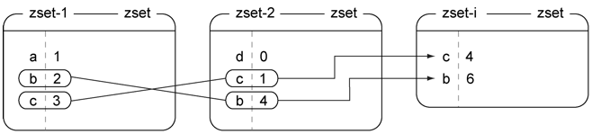
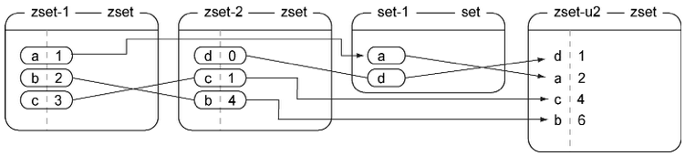

第3章  Redis命令
======================

本章涵盖：

- 字符串命令、列表命令和集合命令
- 散列命令和有序集合命令
- 发布命令与订阅命令
- 其他命令

本章将介绍一些没有在第1章和第2章出现过的Redis命令，学习这些命令有助于读者在已有示例的基础上构建更为复杂的程序，并学会如何更好地去解决自己遇到的问题。本章将使用客户端与Redis服务器进行简单的互动，并以此来介绍命令的用法，如果读者想要看一些更为具体的代码示例，那么可以阅读第2章。

根据结构或者概念的不同，本章将多个命令分别放到了多个不同的节里面进行介绍，介绍的这些命令都是各种应用程序里面最经常会用到的命令。和第1章介绍各个结构时的做法类似，本章也是通过与客户端进行互动的方式来介绍各个命令，在有需要的时候，文中还会说明本书在哪些章节用到了正在介绍的命令。

在每个不同的数据类型的章节里，展示的都是该数据类型所独有的、最具代表性的命令。首先让我们来看看，除了\ ``GET``\ 和\ ``SET``\ 之外，Redis的字符串还支持哪些命令。

.. note:: 查阅本章未介绍命令的文档

    本章只会介绍最常用的Redis命令或者本书后续章节会用到的命令，如果读者需要一份完整的命令文档作为参考，那么可以访问\ http://redis.io/commands\ 。

.. note:: Redis 2.4和Redis 2.6

    正如附录A所说，在本书编写之际，Windows平台上面只有Redis 2.4可用，而本书却会用到只有Redis 2.6或以上版本才支持的特性。Redis 2.4和Redis 2.6之间的主要区别包括（但不限于）Lua脚本（将在第11章介绍）、毫秒精度的过期操作（相关的\ ``PTTL``\ 命令、\ ``PEXPIRE``\ 命令和\ ``PEXPIREAT``\ 命令将在本章介绍）、一些二进制位操作（\ ``BITOP``\ 命令和\ ``BITCOUNT``\ 命令），另外还有一些在Redis 2.6以前只能接受单个参数的命令，比如\ ``RPUSH``\ 、\ ``LPUSH``\ 、\ ``SADD``\ 、\ ``SREM``\ 、\ ``HDEL``\ 、\ ``ZADD``\ 和\ ``ZREM``\ ，从Redis 2.6开始都可以接受多个参数了。

3.1  字符串
----------------

本书在第1章和第2章曾经说过，Redis的字符串就是一个由字节组成的序列，它们和很多编程语言里面的字符串没有什么显著的不同，跟C或者C++风格的字符数组也相去不远。在Redis里面，字符串可以存储以下三种类型的值：

- 字节串（byte string）
- 整数
- 浮点数

用户可以通过给定一个任意的数值，对存储着整数或者浮点数的字符串执行自增（increment）或者自减（decrement）操作，在有需要的时候，Redis还会将整数转换成浮点数。整数的取值范围和系统的长整数（long integer）的取值范围相同（在32位系统上，整数就是32位有符号整数，在64位系统上，整数就是64位有符号整数），而浮点数的取值范围和精度则与IEEE 754标准的双精度浮点数（double）相同。Redis明确地区分字节串、整数和浮点数的做法是一种优势，比起只能够存储字节串的做法，Redis的做法在数据表现方面有更大的灵活性。

本节将对Redis里面最简单的结构——字符串进行讨论，介绍基本的数值自增和自减操作，以及二进制位（bit）和子串（substring）处理命令，读者可能会惊讶地发现，Redis里面最简单的结构居然也有如此强大的作用。

表3-1展示了对Redis字符串执行自增和自减操作的命令。

----

表3-1   Redis中的自增命令和自减命令

+-------------------+---------------------------------------------------------------------------------------------------------------+
|     命令          |                                   用例和描述                                                                  |
+===================+===============================================================================================================+
| ``INCR``          | ``INCR key-name``\ ——将键存储的值加上1                                                                        |
+-------------------+---------------------------------------------------------------------------------------------------------------+
| ``DECR``          | ``DECR key-name``\ ——将键存储的值减去1                                                                        |
+-------------------+---------------------------------------------------------------------------------------------------------------+
| ``INCRBY``        | ``INCRBY key-name amount``\ ——将键存储的值加上整数\ ``amount``                                                |
+-------------------+---------------------------------------------------------------------------------------------------------------+
| ``DECRBY``        | ``DECRBY key-name amount``\ ——将键存储的值减去整数\ ``amount``                                                |
+-------------------+---------------------------------------------------------------------------------------------------------------+
| ``INCRBYFLOAT``   | ``INCRBYFLOAT key-name amount``\ ——将键存储的值加上浮点数\ ``amount``\ ，这个命令在Redis 2.6或以上的版本可用  |
+-------------------+---------------------------------------------------------------------------------------------------------------+

----

当用户将一个值存储到Redis字符串里面的时候，如果这个值可以被解释（interpret）为十进制整数或者浮点数，那么Redis会察觉到这一点，并允许用户对这个字符串执行各种\ ``INCR*``\ 和\ ``DECR*``\ 操作。如果用户对一个不存在的键或者一个保存了空串的键执行自增或者自减操作，那么Redis在执行操作时会将这个键的值当作是\ ``0``\ 来处理。如果用户尝试对一个值无法被解释为整数或者浮点数的字符串键执行自增或者自减操作，那么Redis将向用户返回一个错误。代码清单3-1展示了对字符串执行自增操作和自减操作的一些例子。

----

代码清单3-1   这个交互示例展示了Redis的\ ``INCR``\ 操作和\ ``DECR``\ 操作

::

    >>> conn = redis.Redis()
    >>> conn.get('key')             # 尝试获取一个不存在的键将得到一个None值，终端不会显示这个值。
    >>> conn.incr('key')            # 我们既可以对不存在的键执行自增操作，
    1                               # 也可以通过可选的参数来指定自增操作的增量。
    >>> conn.incr('key', 15)        #
    16                              #
    >>> conn.decr('key', 5)         # 和自增操作一样，
    11                              # 执行自减操作的函数也可以通过可选的参数来指定减量。
    >>> conn.get('key')             # 在尝试获取一个键的时候，命令以字符串格式返回被存储的整数。
    '11'                            #
    >>> conn.set('key', '13')       # 即使在设置键时输入的值为字符串，
    True                            # 但只要这个值可以被解释为整数，
    >>> conn.incr('key')            # 我们就可以把它当作整数来处理。
    14                              #

----

在读完本书其他章节之后，读者可能会发现本书只调用了\ ``incr()``\ ，这是因为Python的Redis库在内部使用\ ``INCRBY``\ 命令来实现\ ``incr()``\ 方法，并且这个方法的第二个参数是可选的：如果用户没有为这个可选参数设置值，那么这个参数就会使用默认值1。在编写本书的时候，Python的Redis客户端库支持Redis 2.6的所有命令，这个库通过\ ``incrbyfloat()``\ 方法来实现\ ``INCRBYFLOAT``\ 命令，并且\ ``incrbyfloat()``\ 方法也有类似于\ ``incr()``\ 方法的可选参数特性。

除了自增操作和自减操作之外，Redis还拥有对字节串的其中一部分内容进行读取或者写入的操作（这些操作也可以用于整数或者浮点数，但这种用法并不常见），第9章会展示如何使用这些操作来高效地将结构化数据打包（pack）存储到字符串键里面。表3-2展示了用来处理字符串子串和二进制位的命令。

----

表3-2   供Redis处理子串和二进制位的命令

+---------------+-----------------------------------------------------------------------------------------------------------------------------------------------------------------------------------+
|    命令       |                                                                   用例和描述                                                                                                      |
+===============+===================================================================================================================================================================================+
| ``APPEND``    | ``APPEND key-name value``\ ——将提供的值\ ``value``\ 追加到给定键\ ``key-name``\ 当前存储的值的末尾                                                                                |
+---------------+-----------------------------------------------------------------------------------------------------------------------------------------------------------------------------------+
| ``GETRANGE``  | ``GETRANGE key-name start end``\ ——获取一个由偏移量\ ``start``\ 至偏移量\ ``end``\ 范围内所有字符组成的子串，包括\ ``start``\ 和\ ``end``\ 在内                                   |
+---------------+-----------------------------------------------------------------------------------------------------------------------------------------------------------------------------------+
| ``SETRANGE``  | ``SETRANGE key-name offset value``\ ——将从\ ``start``\ 偏移量开始的子串设置为给定\ ``value``                                                                                      |
+---------------+-----------------------------------------------------------------------------------------------------------------------------------------------------------------------------------+
| ``GETBIT``    | ``GETBIT key-name offset``\ ——将字节串看作是二进制位串（bit string），并返回位串中偏移量为\ ``offset``\ 的二进制位的值                                                            |
+---------------+-----------------------------------------------------------------------------------------------------------------------------------------------------------------------------------+
| ``SETBIT``    | ``SETBIT key-name offset value``\ ——将字节串看作是二进制位串，并将位串中偏移量为\ ``offset``\ 的二进制位的值设置为\ ``value``                                                     |
+---------------+-----------------------------------------------------------------------------------------------------------------------------------------------------------------------------------+
| ``BITCOUNT``  | ``BITCOUNT key-name [start end]``\ ——统计二进制位串里面值为1的二进制位的数量，如果给定了可选的\ ``start``\ 偏移量和\ ``end``\ 偏移量，那么只对偏移量指定范围内的二进制位进行统计  |
+---------------+-----------------------------------------------------------------------------------------------------------------------------------------------------------------------------------+
| ``BITOP``     | ``BITOP operation dest-key key-name [key-name ...]``\ ——对一个或多个二进制位串执行包括并（\ ``AND``\ ）、或（\ ``OR``\ ）、异或（\ ``XOR``\ ）、                                  |
|               | 非（\ ``NOT``\ ）在内的任意一种按位运算操作（bitwise operation），并将计算得出的结果保存在\ ``dest-key``\ 键里面                                                                  |
+---------------+-----------------------------------------------------------------------------------------------------------------------------------------------------------------------------------+

----

.. note:: GETRANGE和SUBSTR

    Redis现在的\ ``GETRANGE``\ 命令是由以前的\ ``SUBSTR``\ 命令改名而来的，因此，Python客户端至今仍然可以使用\ ``substr()``\ 方法来获取子串，但如果读者使用的是2.6或以上版本的Redis，那么最好还是使用\ ``getrange()``\ 方法来获取子串。

在使用\ ``SETRANGE``\ 或者\ ``SETBIT``\ 命令对字符串进行写入的时候，如果字符串当前的长度不能满足写入的要求，那么Redis会自动地使用空字节（null）来将字符串扩展至所需的长度，然后才执行写入或者更新操作。在使用\ ``GETRANGE``\ 读取字符串的时候，超出字符串末尾的数据会被视为是空串，而在使用\ ``GETBIT``\ 读取二进制位串的时候，超出字符串末尾的二进制位会被视为是\ ``0``\ 。代码清单3-2展示了一些字符串处理命令的使用示例。

----

代码清单3-2   这个交互示例展示了Redis的子串操作和二进制位操作

::

    >>> conn.append('new-string-key', 'hello ')     # 将字符串'hello'追加到目前并不存在的'new-string-key'键里。
    6L                                              # APPEND命令在执行之后会返回字符串当前的长度。
    >>> conn.append('new-string-key', 'world!')
    12L                                             #
    >>> conn.substr('new-string-key', 3, 7)         # Redis的索引以0为开始，在进行范围访问时，范围的终点（endpoint）默认也包含在这个范围之内。
    'lo wo'                                         # 字符串'lo wo'位于字符串'hello world!'的中间。
    >>> conn.setrange('new-string-key', 0, 'H')     # 对字符串执行范围设置操作。
    12                                              # SETRANGE命令在执行之后同样会返回字符串的当前总长度。
    >>> conn.setrange('new-string-key', 6, 'W')
    12
    >>> conn.get('new-string-key')                  # 查看字符串的当前值。
    'Hello World!'                                  # 前面执行的两个SETRANGE命令成功地将字母h和w从原来的小写改成了大写。
    >>> conn.setrange('new-string-key', 11, ', how are you?')   # SETRANGE命令既可以用于替换字符串里已有的内容，又可以用于增长字符串。
    25
    >>> conn.get('new-string-key')
    'Hello World, how are you?'                     # 前面执行的SETRANGE命令移除了字符串末尾的感叹号，并将更多字符追加到了字符串末尾。
    >>> conn.setbit('another-key', 2, 1)            # 对超出字符串长度的二进制位进行设置时，超出的部分会被填充为空字节。
    0                                               # SETBIT命令会返回二进制位被设置之前的值。
    >>> conn.setbit('another-key', 7, 1)            # 在对Redis存储的二进制位进行解释（interpret）时，
    0                                               # 请记住Redis存储的二进制位是按照偏移量从高到低排列的。
    >>> conn.get('another-key')                     #
    '!'                                             # 通过将第2个二进制位以及第7个二进制位的值设置为1，键的值将变为‘!’，即字符33 。

----

很多键值数据库只能将数据存储为普通的字符串，并且不提供任何字符串处理操作，有一些键值数据库允许用户将字节追加到字符串的前面或者后面，但是却没办法像Redis一样对字符串的子串进行读写。从很多方面来讲，即使Redis只支持字符串结构，并且只支持本节列出的字符串处理命令，Redis也比很多其他别的数据库要强大得多；通过使用子串操作和二进制位操作，配合\ ``WATCH``\ 命令、\ ``MULTI``\ 命令和\ ``EXEC``\ 命令（我们将在3.7.2节对这三个命令进行初步的介绍，后面在第4章里会对它们进行更深入的介绍），用户甚至可以自己动手去构建任何他们想要的数据结构。第9章会介绍如何使用字符串来存储一种简单的映射，这种映射可以在某些情况下节省大量内存。

只要花些心思，我们甚至可以将字符串当作列表来使用，但这种做法能够执行的列表操作并不多，更好的办法是直接使用下一节介绍的列表结构，Redis为这种结构提供了丰富的列表操作命令。

3.2  列表
----------------------

在第1章曾经介绍过，Redis的列表允许用户从序列的两端推入或者弹出元素、获取元素，执行各种常见的列表操作。除此之外，列表还可以用来存储任务信息、最近浏览过的文章或者常用联系人信息。

本节将对列表这个由多个字符串值组成的有序序列结构进行介绍，并展示一些最常用的列表处理命令，阅读本节可以让读者学会如何使用这些命令来处理列表。表3-3展示了其中一部分最常用的列表命令。

----

表3-3   一些常用的列表命令

+---------------+-------------------------------------------------------------------------------------------------------------------------------------------+
|   命令        |                               用例和描述                                                                                                  |
+===============+===========================================================================================================================================+
| ``RPUSH``     | ``RPUSH key-name value [value ...]``\ ——将一个或多个值推入到列表的右端                                                                    |
+---------------+-------------------------------------------------------------------------------------------------------------------------------------------+
| ``LPUSH``     | ``LPUSH key-name value [value ...]``\ ——将一个或多个值推入到列表的左端                                                                    |
+---------------+-------------------------------------------------------------------------------------------------------------------------------------------+
| ``RPOP``      | ``RPOP key-name``\ ——移除并返回列表最右端的元素                                                                                           |
+---------------+-------------------------------------------------------------------------------------------------------------------------------------------+
| ``LPOP``      | ``LPOP key-name``\ ——移除并返回列表最左端的元素                                                                                           |
+---------------+-------------------------------------------------------------------------------------------------------------------------------------------+
| ``LINDEX``    | ``LINDEX key-name offset``\ ——返回列表中偏移量为\ ``offset``\ 的元素                                                                      |
+---------------+-------------------------------------------------------------------------------------------------------------------------------------------+
| ``LRANGE``    | ``LRANGE key-name start end``\ ——返回列表从\ ``start``\ 偏移量到\ ``end``\ 偏移量范围内的所有元素，包括\ ``start``\ 和\ ``end``           |
+---------------+-------------------------------------------------------------------------------------------------------------------------------------------+
| ``LTRIM``     | ``LTRIM key-name start end``\ ——对列表进行修剪，只保留从\ ``start``\ 偏移量到\ ``end``\ 偏移量范围内的元素，包括\ ``start``\ 和\ ``end``  |
+---------------+-------------------------------------------------------------------------------------------------------------------------------------------+

----

因为本书在第1章已经对列表的几个推入和弹出操作进行了简单的介绍，所以读者应该不会对上面列出的推入和弹出操作感到陌生，代码清单3-3展示了这些操作的用法。

----

代码清单3-3   这个交互示例展示了Redis列表的推入操作和弹出操作

::

    >>> conn.rpush('list-key', 'last')          # 在向列表推入元素时，
    1L                                          # 推入操作执行完毕之后会返回列表当前的长度。
    >>> conn.lpush('list-key', 'first')         # 可以很容易地对列表的两端执行推入操作。
    2L
    >>> conn.rpush('list-key', 'new last')
    3L
    >>> conn.lrange('list-key', 0, -1)          # 从语义上来说，列表的左端为开头，右端为结尾。
    ['first', 'last', 'new last']               #
    >>> conn.lpop('list-key')                   # 通过重复地弹出列表左端的元素，
    'first'                                     # 可以按照从左到右的顺序来获取列表中的元素。
    >>> conn.lpop('list-key')                   #
    'last'                                      #
    >>> conn.lrange('list-key', 0, -1)
    ['new last']
    >>> conn.rpush('list-key', 'a', 'b', 'c')   # 可以同时推入多个元素。
    4L
    >>> conn.lrange('list-key', 0, -1)
    ['new last', 'a', 'b', 'c']
    >>> conn.ltrim('list-key', 2, -1)           # 可以从列表的左端、右端或者左右两端删减任意数量的元素。
    True                                        #
    >>> conn.lrange('list-key', 0, -1)          #
    ['b', 'c']                                  #

-----

这个示例里的\ ``LTRIM``\ 命令是新的，组合使用\ ``LTRIM``\ 和\ ``LRANGE``\ 可以构建出一个在功能上类似于\ ``LPOP``\ 或者\ ``RPOP``\ 的操作，它能够一次返回并弹出多个元素。本章稍后将会介绍原子地\ [#f1]_\ 执行多个命令的方法，而更高级的Redis事务特性则会在第4章介绍。

有几个列表命令可以将元素从一个列表移动到另一个列表，或者阻塞（block）执行命令的客户端直到有其他客户端给列表添加元素为止，这些命令在第1章都没有介绍过，表3-4列出了这些阻塞弹出命令和元素移动命令。

----

表3-4   阻塞式的列表弹出命令以及在列表之间移动元素的命令

+-------------------+---------------------------------------------------------------------------------------------------------------------------------------------------------------+
|     命令          |                                                                          用例和描述                                                                           |
+===================+===============================================================================================================================================================+
| ``BLPOP``         | ``BLPOP key-name [key-name ...] timeout``\ ——从第一个非空列表中弹出位于最左端的元素，或者在\ ``timeout``\ 秒之内阻塞并等待可弹出的元素出现                    |
+-------------------+---------------------------------------------------------------------------------------------------------------------------------------------------------------+
| ``BRPOP``         | ``BRPOP key-name [key-name ...] timeout``\ ——从第一个非空列表中弹出位于最右端的元素，或者在\ ``timeout``\ 秒之内阻塞并等待可弹出的元素出现                    |
+-------------------+---------------------------------------------------------------------------------------------------------------------------------------------------------------+
| ``RPOPLPUSH``     | ``RPOPLPUSH source-key dest-key``\ ——从\ ``source-key``\ 列表中弹出位于最右端的元素，然后将这个元素推入到\ ``dest-key``\ 列表的最左端，并向用户返回这个元素   |
+-------------------+---------------------------------------------------------------------------------------------------------------------------------------------------------------+
| ``BRPOPLPUSH``    | ``BRPOPLPUSH source-key dest-key timeout``\ ——从\ ``source-key``\ 列表中弹出位于最右端的元素，然后将这个元素推入到\ ``dest-key``\ 列表的最左端，              |
|                   | 并向用户返回这个元素；如果\ ``source-key``\ 为空，那么在\ ``timeout``\ 秒之内阻塞并等待可弹出的元素出现                                                       |
+-------------------+---------------------------------------------------------------------------------------------------------------------------------------------------------------+

----

在第6章讨论队列时，这组命令尤其有用。代码清单3-4展示了几个使用\ ``BRPOPLPUSH``\ 移动列表元素的例子以及使用\ ``BLPOP``\ 从列表里面弹出多个元素的例子。

----

代码清单3-4   这个交互示例展示了Redis列表的阻塞弹出命令以及元素移动命令

::

    >>> conn.rpush('list', 'item1')             # 将一些元素添加到两个列表里面。
    1                                           #
    >>> conn.rpush('list', 'item2')             #
    2                                           #
    >>> conn.rpush('list2', 'item3')            #
    1                                           #
    >>> conn.brpoplpush('list2', 'list', 1)     # 将一个元素从一个列表移动到另一个列表，
    'item3'                                     # 并返回被移动的元素。
    >>> conn.brpoplpush('list2', 'list', 1)     # 当列表不包含任何元素时，阻塞弹出操作会在给定的时限内等待可弹出的元素出现，并在时限到达后返回None（交互终端不会打印这个值）。
    >>> conn.lrange('list', 0, -1)              # 弹出“list2”最右端的元素，
    ['item3', 'item1', 'item2']                 # 并将弹出的元素推入到“list”的左端。
    >>> conn.brpoplpush('list', 'list2', 1)
    'item2'
    >>> conn.blpop(['list', 'list2'], 1)        # BLPOP命令会从左到右地检查传入的列表，
    ('list', 'item3')                           # 并对最先遇到的非空列表执行弹出操作。
    >>> conn.blpop(['list', 'list2'], 1)        #
    ('list', 'item1')                           #
    >>> conn.blpop(['list', 'list2'], 1)        #
    ('list2', 'item2')                          #
    >>> conn.blpop(['list', 'list2'], 1)        #
    >>>

-----

对于阻塞弹出命令和弹出并推入命令，最常见的用例就是消息传递（messaging）和任务队列（task queue）的开发，本书将在第6章对这两个主题进行介绍。

.. note:: 练习：通过列表来降低内存占用

    在2.1节和2.5节，我们使用了有序集合来记录用户最近浏览过的商品，并把用户浏览这些商品时的时间戳设置为分值，从而使得程序可以在清理旧会话的过程中或是执行完购买操作之后，进行相应的数据分析。但由于保存时间戳需要占用相应的空间，所以如果分析操作并不需要用到时间戳的话，那么就没有必要使用有序集合来保存用户最近浏览过的商品了。为此，请在保证语义不变的情况下，将\ ``update_token()``\ 函数里面使用的有序集合替换成列表。提示：如果读者在解答这个问题时遇上困难的话，可以到本书的6.1.1节找找灵感。

列表的一个主要优点在于它可以包含多个字符串值，这使得用户可以将数据集中在同一个地方。Redis的集合也提供了与列表类似的特性，但集合只能保存各不相同的元素。在接下来的一节，就让我们来看看不能保存相同元素的集合都能做些什么吧。

3.3  集合
-------------------

Redis的集合以无序的方式来存储多个各不相同的元素，用户可以快速地对集合执行添加元素、移除元素以及检查一个元素是否存在于集合里的操作。第1章曾经对集合进行过简单的介绍，在实现文章投票网站的时候，用集合实现了记录文章已投票用户名单以及文章属于哪个群组的功能。

本节将对最常用的集合命令进行介绍，包括插入命令、移除命令、将元素从一个集合移动到另一个集合的命令，以及对多个集合执行交集运算、并集运算和差集运算的命令。阅读本节也有助于读者更好地理解本书在第7章介绍的搜索示例。

表3-5展示了其中一部分最常用的集合命令。

----

表3-5  一些常用的集合命令

+-------------------+-------------------------------------------------------------------------------------------------------------------------------+
|     命令          |                                                                           用例和描述                                          |
+===================+===============================================================================================================================+
| ``SADD``          | ``SADD key-name item [item ...]``\ ——将一个或多个元素添加到集合里面，并返回被添加元素当中原本并不存在于集合里面的元素数量     |
+-------------------+-------------------------------------------------------------------------------------------------------------------------------+
| ``SREM``          | ``SREM key-name item [item ...]``\ ——从集合里面移除一个或多个元素，并返回被移除元素的数量                                     |
+-------------------+-------------------------------------------------------------------------------------------------------------------------------+
| ``SISMEMBER``     | ``SISMEMBER key-name item``\ ——检查元素\ ``item``\ 是否存在于集合\ ``key-name``\ 里                                           | 
+-------------------+-------------------------------------------------------------------------------------------------------------------------------+
| ``SCARD``         | ``SCARD key-name``\ ——返回集合包含的元素的数量                                                                                |
+-------------------+-------------------------------------------------------------------------------------------------------------------------------+
| ``SMEMBERS``      | ``SMEMBERS key-name``\ ——返回集合包含的所有元素                                                                               |
+-------------------+-------------------------------------------------------------------------------------------------------------------------------+
| ``SRANDMEMBER``   | ``SRANDMEMBER key-name [count]``\ ——从集合里面随机地返回一个或多个元素。当\ ``count``\ 为正数时，命令返回的随机元素不会重复； |
|                   | 当\ ``count``\ 为负数时，命令返回的随机元素可能会出现重复                                                                     |
+-------------------+-------------------------------------------------------------------------------------------------------------------------------+
| ``SPOP``          | ``SPOP key-name``\ ——从集合里面移除并返回一个随机元素                                                                         |
+-------------------+-------------------------------------------------------------------------------------------------------------------------------+
| ``SMOVE``         | ``SMOVE source-key dest-key item``\ ——如果集合\ ``source-key``\ 包含元素\ ``item``\ ，                                        |
|                   | 那么从集合\ ``source-key``\ 里面移除元素\ ``item``\ ，并将元素\ ``item``\ 添加到集合\ ``dest-key``\ 中；                      |
|                   | 如果\ ``item``\ 被成功移除，那么命令返回1，否则返回0                                                                          |
+-------------------+-------------------------------------------------------------------------------------------------------------------------------+

----

表3-5里面的不少命令都已经在第1章介绍过了，
代码清单3-5展示了这些命令的使用示例。

----

代码清单3-5   这个交互示例展示了Redis中的一些常用的集合命令

::

    >>> conn.sadd('set-key', 'a', 'b', 'c')         # SADD命令会将那些目前并不存在于集合里面的元素添加到集合里面，
    3                                               # 并返回被添加元素的数量。
    >>> conn.srem('set-key', 'c', 'd')              # srem函数在元素被成功移除时返回True，
    True                                            # 移除失败时返回False；
    >>> conn.srem('set-key', 'c', 'd')              # 注意这是Python客户端的一个bug，
    False                                           # 实际上Redis的SREM命令返回的是被移除元素的数量，而不是布尔值。
    >>> conn.scard('set-key')                       # 查看集合包含的元素数量。
    2                                               #
    >>> conn.smembers('set-key')                    # 获取集合包含的所有元素。
    set(['a', 'b'])                                 #
    >>> conn.smove('set-key', 'set-key2', 'a')      # 可以很容易地将元素从一个集合移动到另一个集合。
    True                                            #
    >>> conn.smove('set-key', 'set-key2', 'c')      # 在执行SMOVE命令时，
    False                                           # 如果用户想要移动的元素不存在于第一个集合里，
    >>> conn.smembers('set-key2')                   # 那么移动操作就不会执行。
    set(['a'])                                      #

----

通过使用上面展示的命令可以将各不相同的多个元素添加到集合里面，比如第1章就使用集合记录了文章已投票用户名单，以及文章属于哪个群组。但集合真正厉害的地方在于组合和关联多个集合，表3-6展示了相关的命令。

----

表3-6   用于组合和处理多个集合的Redis命令

+-------------------+-------------------------------------------------------------------------------------------------------------------------------------------------------+
|     命令          |                                          用例和描述                                                                                                   |
+===================+=======================================================================================================================================================+
| ``SDIFF``         | ``SDIFF key-name [key-name ...]``\ ——返回那些存在于第一个集合、但不存在于其他集合中的元素（数学上的差集运算）                                         |
+-------------------+-------------------------------------------------------------------------------------------------------------------------------------------------------+
| ``SDIFFSTORE``    | ``SDIFFSTORE dest-key key-name [key-name ...]``\ ——将那些存在于第一个集合、但并不存在于其他集合中的元素（数学上的差集运算）存储到\ ``dest-key``\ 中   |
+-------------------+-------------------------------------------------------------------------------------------------------------------------------------------------------+
| ``SINTER``        | ``SINTER key-name [key-name ...]``\ ——返回那些同时存在于所有集合中的元素（数学上的交集运算）                                                          |
+-------------------+-------------------------------------------------------------------------------------------------------------------------------------------------------+
| ``SINTERSTORE``   | ``SINTERSTORE dest-key key-name [key-name ...]``\ ——将那些同时存在于所有集合的元素（数学上的交集运算）保存到键\ ``dest-key``                          |
+-------------------+-------------------------------------------------------------------------------------------------------------------------------------------------------+
| ``SUNION``        | ``SUNION key-name [key-name ...]``\ ——返回那些至少存在于一个集合中的元素（数学上的并集计算）                                                          |
+-------------------+-------------------------------------------------------------------------------------------------------------------------------------------------------+
| ``SUNIONSTORE``   | ``SUNIONSTORE dest-key key-name [key-name ...]``\ ——将那些至少存在于一个集合中的元素（数学上的并集计算）存储到\ ``dest-key``\ 中                      |
+-------------------+-------------------------------------------------------------------------------------------------------------------------------------------------------+

----

这些命令分别是并集运算、交集运算和差集运算这三个基本集合操作的“返回结果”版本和“存储结果”版本，代码清单3-6展示了这些命令的使用示例。

----

代码清单3-6  这个交互示例展示了Redis的差集运算、交集运算以及并集运算

::

    >>> conn.sadd('skey1', 'a', 'b', 'c', 'd')  # 首先将一些元素添加到两个集合里面。
    4                                           #
    >>> conn.sadd('skey2', 'c', 'd', 'e', 'f')  #
    4                                           #
    >>> conn.sdiff('skey1', 'skey2')            # 计算从第一个集合中移除第二个集合所有元素之后的结果。
    set(['a', 'b'])                             #
    >>> conn.sinter('skey1', 'skey2')           # 还可以找出同时存在于两个集合中的元素。
    set(['c', 'd'])                             #
    >>> conn.sunion('skey1', 'skey2')           # 可以找出两个结合中的所有元素。
    set(['a', 'c', 'b', 'e', 'd', 'f'])         #

----

和Python的集合相比，Redis的集合除了可以被多个客户端远程地进行访问之外，其他的语义和功能基本都是相同的。

接下来的一节将对Redis的散列处理命令进行介绍，这些命令允许用户将多个相关的键值对存储在一起，以便执行获取操作和更新操作。

3.4  散列
----------------

第1章提到过，Redis的散列可以让用户将多个键值对存储到一个Redis键里面。从功能上来说，Redis为散列值提供了一些和字符串值相同的特性，使得散列非常适用于将一些相关的数据存储在一起。我们可以把这种数据聚集看作是关系数据库中的行，或者文档存储中的文档。

本节将对最常用的散列命令进行介绍：其中包括添加和删除键值对的命令、获取所有键值对的命令，以及对键值对的值进行自增或者自减操作的命令。阅读这一节可以让读者学习到如何将数据存储到散列里面，以及这样做的好处是什么。表3-7展示了一部分常用的散列命令。

----

表3-7   用于添加和删除键值对的散列操作

+-----------+---------------------------------------------------------------------------------------------------+
|  命令     |                               用例和描述                                                          |
+===========+===================================================================================================+
| ``HMGET`` | ``HMGET key-name key [key ...]``\ ——从散列里面获取一个或多个键的值                                |
+-----------+---------------------------------------------------------------------------------------------------+
| ``HMSET`` | ``HMSET key-name key value [key value ...]``\ ——为散列里面的一个或多个键设置值                    |
+-----------+---------------------------------------------------------------------------------------------------+
| ``HDEL``  | ``HDEL key-name key [key ...]``\ ——删除散列里面的一个或多个键值对，返回成功找到并删除的键值对数量 |
+-----------+---------------------------------------------------------------------------------------------------+
| ``HLEN``  | ``HLEN key-name``\ ——返回散列包含的键值对数量                                                     |
+-----------+---------------------------------------------------------------------------------------------------+

----

在表3-7列出的命令当中，\ ``HDEL``\ 命令已经在第1章中介绍过了，而\ ``HLEN``\ 命令以及用于一次读取或者设置多个键的\ ``HMGET``\ 和\ ``HMSET``\ 则是新出现的命令。像\ ``HMGET``\ 和\ ``HMSET``\ 这种批量处理多个键的命令既可以给用户带来方便，又可以通过减少命令的调用次数以及客户端与Redis之间的通信往返次数来提升Redis的性能。代码清单3-7展示了这些命令的使用方法。

----

代码清单3-7   这个交互示例展示了Redis中的一些常用的散列命令

::

    >>> conn.hmset('hash-key', {'k1':'v1', 'k2':'v2', 'k3':'v3'})   # 使用HMSET命令可以一次将多个键值对添加到散列里面。
    True                                                            #
    >>> conn.hmget('hash-key', ['k2', 'k3'])                        #  使用HMGET命令可以一次获取多个键的值。
    ['v2', 'v3']                                                    #
    >>> conn.hlen('hash-key')                                       # HLEN命令通常用于调试一个包含非常多键值对的散列。
    3                                                               #
    >>> conn.hdel('hash-key', 'k1', 'k3')                           # HDEL命令在成功地移除了至少一个键值对时返回True，
    True                                                            # 因为HDEL命令已经可以同时删除多个键值对了，所以Redis没有实现HMDEL命令。

----

第1章介绍的\ ``HGET``\ 命令和\ ``HSET``\ 命令分别是\ ``HMGET``\ 命令和\ ``HMSET``\ 命令的单参数版本，这些命令的唯一区别在于单参数版本每次执行只能处理一个键值对，而多参数版本每次执行可以处理多个键值对。

表3-8列出了散列的其他几个批量操作命令，以及一些和字符串操作类似的散列命令。

----

表3-8  展示Redis散列的更高级特性

+-------------------+-----------------------------------------------------------------------------------------------+
|      命令         |                               用例和描述                                                      |
+===================+===============================================================================================+
| ``HEXISTS``       | ``HEXISTS key-name key``\ ——检查给定键是否存在于散列中                                        |
+-------------------+-----------------------------------------------------------------------------------------------+
| ``HKEYS``         | ``HKEYS key-name``\ ——获取散列包含的所有键                                                    |
+-------------------+-----------------------------------------------------------------------------------------------+
| ``HVALS``         | ``HVALS key-name``\ ——获取散列包含的所有值                                                    |
+-------------------+-----------------------------------------------------------------------------------------------+
| ``HGETALL``       | ``HGETALL key-name``\ ——获取散列包含的所有键值对                                              |
+-------------------+-----------------------------------------------------------------------------------------------+
| ``HINCRBY``       | ``HINCRBY key-name key increment``\ ——将键\ ``key``\ 保存的值加上整数\ ``increment``          |
+-------------------+-----------------------------------------------------------------------------------------------+
| ``HINCRBYFLOAT``  | ``HINCRBYFLOAT key-name key increment``\ ——将键\ ``key``\ 保存的值加上浮点数\ ``increment``   |
+-------------------+-----------------------------------------------------------------------------------------------+

----

尽管有\ ``HGETALL``\ 存在，但\ ``HKEYS``\ 和\ ``HVALUES``\ 也是非常有用的：如果散列包含的值非常大，那么用户可以先使用\ ``HKEYS``\ 取出散列包含的所有键，然后再使用\ ``HGET``\ 一个接一个地取出键的值，从而避免因为一次获取多个大体积的值而导致服务器阻塞。

``HINCRBY``\ 和\ ``HINCRBYFLOAT``\ 可能会让读者想起用于处理字符串的\ ``INCRBY``\ 和\ ``INCRBYFLOAT``\ ，这两对命令拥有相同的语义，它们的不同在于\ ``HINCRBY``\ 和\ ``HINCRBYFLOAT``\ 处理的是散列，而不是字符串。代码清单3-8展示了这些命令的使用方法。

----

代码清单3-8   这个交互示例展示了Redis散列的一些更高级的特性

::

    >>> conn.hmset('hash-key2', {'short':'hello', 'long':1000*'1'}) # 在考察散列的时候，我们可以只取出散列包含的键，而不必传输大的键值。
    True                                                            #
    >>> conn.hkeys('hash-key2')                                     #
    ['long', 'short']                                               #
    >>> conn.hexists('hash-key2', 'num')                            # 检查给定的键是否存在于散列中。
    False                                                           #
    >>> conn.hincrby('hash-key2', 'num')                            # 和字符串一样，
    1L                                                              # 对散列中一个尚未存在的键执行自增操作时，
    >>> conn.hexists('hash-key2', 'num')                            # Redis会将键的值当作0来处理。
    True                                                            #

----

正如前面所说，在处理键值对的值非常大的散列时，用户可以先使用\ ``HKEYS``\ 获取散列的所有键，然后通过只取出必要的值来减少要传输的数据量。除此之外，用户还可以像使用\ ``SISMEMBER``\ 检查一个元素是否存在于集合里面一样，使用\ ``HEXISTS``\ 检查一个键是否存在于散列里面。另外本书的第1章也用到了本节刚刚回顾过的\ ``HINCRBY``\ 来记录文章被投票的次数。

在接下来的一节，我们要了解的是之后的章节里面会经常用到的有序集合结构。

3.5  有序集合
--------------------

和散列存储着键与值之间的映射类似，有序集合也存储着成员与分值之间的映射，并且提供了分值\ [#f2]_\ 处理命令，以及根据分值大小有序地获取（fetch）或扫描（scan）成员和分值的命令。本书曾在第1章使用有序集合实现过基于发表时间排序的文章列表和基于投票数量排序的文章列表，在第2章使用有序集合存储过cookie的过期时间。

本节将对操作有序集合的命令进行介绍，包括在有序集合里面进行添加和更新元素的命令，以及对有序集合进行交集运算和并集运算的命令。阅读本节可以加深读者对有序集合的认识，从而帮助读者更好地理解本书在第1章、第5章、第6章和第7章展示的有序集合示例。

表3-9展示了一部分常用的有序集合命令。

----

表3-9  一些常用的有序集合命令

+---------------+---------------------------------------------------------------------------------------------------------------------------------------------------------------------------------------+
|   命令        |                                                      用例和描述                                                                                                                       |
+===============+=======================================================================================================================================================================================+
| ``ZADD``      | ``ZADD key-name score member [score member ...]``\ ——将带有给定分值的成员添加到有序集合里面                                                                                           |
+---------------+---------------------------------------------------------------------------------------------------------------------------------------------------------------------------------------+
| ``ZREM``      | ``ZREM key-name member [member ...]``\ ——从有序集合里面移除给定的成员，并返回被移除成员的数量                                                                                         |
+---------------+---------------------------------------------------------------------------------------------------------------------------------------------------------------------------------------+
| ``ZCARD``     | ``ZCARD key-name``\ ——返回有序集合包含的成员数量                                                                                                                                      |
+---------------+---------------------------------------------------------------------------------------------------------------------------------------------------------------------------------------+
| ``ZINCRBY``   | ``ZINCRBY key-name increment member``\ ——将\ ``member``\ 成员的分值加上\ ``increment``                                                                                                |
+---------------+---------------------------------------------------------------------------------------------------------------------------------------------------------------------------------------+
| ``ZCOUNT``    | ``ZCOUNT key-name min max``\ ——返回分值介于\ ``min``\ 和\ ``max``\ 之间的成员数量                                                                                                     |
+---------------+---------------------------------------------------------------------------------------------------------------------------------------------------------------------------------------+
| ``ZRANK``     | ``ZRANK key-name member``\ ——返回成员\ ``member``\ 在\ ``key-name``\ 中的排名                                                                                                         |
+---------------+---------------------------------------------------------------------------------------------------------------------------------------------------------------------------------------+
| ``ZSCORE``    | ``ZSCORE key-name member``\ ——返回成员\ ``member``\ 的分值                                                                                                                            |
+---------------+---------------------------------------------------------------------------------------------------------------------------------------------------------------------------------------+
| ``ZRANGE``    | ``ZRANGE key-name start stop [WITHSCORES]``\ ——返回有序集合中排名介于\ ``start``\ 和\ ``stop``\ 之间的成员，如果给定了可选的\ ``WITHSCORES``\ 选项，那么命令会将成员的分值也一并返回  |
+---------------+---------------------------------------------------------------------------------------------------------------------------------------------------------------------------------------+

----

在上面列出的命令当中，有一部分命令已经在本书的第1章和第2章使用过了，所以读者应该不会对它们感到陌生，接下来的代码清单回顾了这些命令的用法。

----

代码清单3-9  这个交互示例展示了Redis中的一些常用的有序集合命令

::

    >>> conn.zadd('zset-key', 'a', 3, 'b', 2, 'c', 1)   # 在Python客户端执行ZADD命令需要先输入成员、后输入分值，
    3                                                   # 这跟Redis标准的先输入分值、后输入成员的做法正好相反。
    >>> conn.zcard('zset-key')                          # 取得有序集合的大小可以让我们在某些情况下知道是否需要对有序集合进行修剪。
    3                                                   #
    >>> conn.zincrby('zset-key', 'c', 3)                # 跟字符串和散列一样，
    4.0                                                 # 有序集合的成员也可以执行自增操作。
    >>> conn.zscore('zset-key', 'b')                    # 获取单个成员的分值对于实现计数器或者排行榜之类的功能非常有用。
    2.0                                                 #
    >>> conn.zrank('zset-key', 'c')                     # 获取指定成员的排名（排名以0为开始），
    2                                                   # 之后可以根据这个排名来决定ZRANGE的访问范围。
    >>> conn.zcount('zset-key', 0, 3)                   # 对于某些任务来说，
    2L                                                  # 统计给定分值范围内的元素数量非常有用。
    >>> conn.zrem('zset-key', 'b')                      # 从有序集合里面移除成员和添加成员一样容易。
    True                                                #
    >>> conn.zrange('zset-key', 0, -1, withscores=True) # 在进行调试时，我们通常会使用ZRANGE取出有序集合里包含的所有元素，
    [('a', 3.0), ('c', 4.0)]                            # 但是在实际用例中，通常一次只会取出一小部分元素。

----

因为\ ``ZADD``\ 、\ ``ZREM``\ 、\ ``ZINCRBY``\ 、\ ``ZSCORE``\ 和\ ``ZRANGE``\ 都已经在第1章和第2章介绍过了，所以读者应该不会对它们感到陌生。\ ``ZCOUNT``\ 命令和其他命令不太相同，它主要用于计算分值在给定范围内的成员数量。

表3-10展示了Redis另外一些非常有用的有序集合命令。

----

表3-10  有序集合的范围型数据获取命令和范围型数据删除命令，以及并集命令和交集命令

+-----------------------+---------------------------------------------------------------------------------------------------------------------------------------------------------------------------+
|        命令           |                                                        用例和描述                                                                                                         |
+=======================+===========================================================================================================================================================================+
| ``ZREVRANK``          | ``ZREVRANK key-name member``\ ——返回有序集合里成员\ ``member``\ 所处的位置，成员按照分值从大到小排列                                                                      |
+-----------------------+---------------------------------------------------------------------------------------------------------------------------------------------------------------------------+
| ``ZREVRANGE``         | ``ZREVRANGE key-name start stop [WITHSCORES]``\ ——返回有序集合给定排名范围内的成员，成员按照分值从大到小排列                                                              |
+-----------------------+---------------------------------------------------------------------------------------------------------------------------------------------------------------------------+
| ``ZRANGEBYSCORE``     | ``ZRANGEBYSCORE key min max [WITHSCORES] [LIMIT offset count]``\ ——返回有序集合中，分值介于\ ``min``\ 和\ ``max``\ 之间的所有成员                                         |
+-----------------------+---------------------------------------------------------------------------------------------------------------------------------------------------------------------------+
| ``ZREVRANGEBYSCORE``  | ``ZREVRANGEBYSCORE key max min [WITHSCORES] [LIMIT offset count]``\ ——获取有序集合中分值介于\ ``min``\ 和\ ``max``\ 之间的所有成员，并按照分值从大到小的顺序来返回它们    |
+-----------------------+---------------------------------------------------------------------------------------------------------------------------------------------------------------------------+
| ``ZREMRANGEBYRANK``   | ``ZREMRANGEBYRANK key-name start stop``\ ——移除有序集合中排名介于\ ``start``\ 和\ ``stop``\ 之间的所有成员                                                                |
+-----------------------+---------------------------------------------------------------------------------------------------------------------------------------------------------------------------+
| ``ZREMRANGEBYSCORE``  | ``ZREMRANGEBYSCORE key-name min max``\ ——移除有序集合中分值介于\ ``min``\ 和\ ``max``\ 之间的所有成员                                                                     |
+-----------------------+---------------------------------------------------------------------------------------------------------------------------------------------------------------------------+
| ``ZINTERSTORE``       | ``ZINTERSTORE dest-key key-count key [key ...] [WEIGHTS weight [weight ...]] [AGGREGATE SUM|MIN|MAX]``\ ——对给定的有序集合执行类似于集合的交集运算                        |
+-----------------------+---------------------------------------------------------------------------------------------------------------------------------------------------------------------------+
| ``ZUNIONSTORE``       | ``ZUNIONSTORE dest-key key-count key [key ...] [WEIGHTS weight [weight ...]] [AGGREGATE SUM|MIN|MAX]``\ ——对给定的有序集合执行类似于集合的并集运算                        |
+-----------------------+---------------------------------------------------------------------------------------------------------------------------------------------------------------------------+

----

在表3-10展示的命令里面，有几个是之前没介绍过的新命令。除了使用逆序来处理有序集合之外，\ ``ZREV*``\ 命令的工作方式和相对应的非逆序命令的工作方式完全一样（逆序就是指元素按照分值从大到小地排列）。代码清单3-10展示了\ ``ZINTERSTORE``\ 和\ ``ZUNIONSTORE``\ 的用法。

----

代码清单3-10  这个交互示例展示了\ ``ZINTERSTORE``\ 命令和\ ``ZUNIONSTORE``\ 命令的用法

::

    >>> conn.zadd('zset-1', 'a', 1, 'b', 2, 'c', 3)                         # 首先创建两个有序集合。
    3                                                                       #
    >>> conn.zadd('zset-2', 'b', 4, 'c', 1, 'd', 0)                         #
    3                                                                       #
    >>> conn.zinterstore('zset-i', ['zset-1', 'zset-2'])                    # 因为ZINTERSTORE和ZUNIONSTORE默认使用的聚合函数为sum，
    2L                                                                      # 所以多个有序集合里成员的分值将被加起来。
    >>> conn.zrange('zset-i', 0, -1, withscores=True)                       #
    [('c', 4.0), ('b', 6.0)]                                                #
    >>> conn.zunionstore('zset-u', ['zset-1', 'zset-2'], aggregate='min')   # 用户可以在执行并集运算和交集运算的时候传入不同的聚合函数，
    4L                                                                      # 共有 sum、min、max 三个聚合函数可选。
    >>> conn.zrange('zset-u', 0, -1, withscores=True)                       #
    [('d', 0.0), ('a', 1.0), ('c', 1.0), ('b', 2.0)]                        #
    >>> conn.sadd('set-1', 'a', 'd')                                        # 用户还可以把集合作为输入传给ZINTERSTORE和ZUNIONSTORE，
    2                                                                       # 命令会将集合看作是成员分值全为1的有序集合来处理。
    >>> conn.zunionstore('zset-u2', ['zset-1', 'zset-2', 'set-1'])          #
    4L                                                                      #
    >>> conn.zrange('zset-u2', 0, -1, withscores=True)                      #
    [('d', 1.0), ('a', 2.0), ('c', 4.0), ('b', 6.0)]                        #

----

有序集合的并集运算和交集运算在刚开始接触时可能会比较难懂，所以本节将使用图片来展示交集运算和并集运算的执行过程。图3-1展示了对两个输入有序集合执行交集运算并得到输出有序集合的过程，这次交集运算使用的是默认的聚合函数``sum``，所以输出有序集合成员的分值都是通过加法计算得出的。

----

图3-1  执行\ ``conn.zinterstore('zset-i', ['zset-1', 'zset-2'])`` 将使得同时存在于\ ``zset-1``\ 和\ ``zset-2``\ 里面的元素被添加到\ ``zset-i``\ 里面

----

并集运算和交集运算不同，只要某个成员存在于至少一个输入有序集合里面，那么这个成员就会被包含在输出有序集合里面。图3-2展示了使用聚合函数\ ``min``\ 执行并集运算的过程，\ ``min``\ 函数在多个输入有序集合都包含同一个成员的情况下，会将最小的那个分值设置为这个成员在输出有序集合的分值。

----

.. image:: image/3-2.png

图3-2  执行\ ``conn.zunionstore('zset-u', ['zset-1', 'zset-2'], aggregate='min')``\ 会将存在于\ ``zset-1``\ 或者\ ``zset-2``\ 里面的元素通过\ ``min``\ 函数组合到\ ``zset-u``\ 里面

----

在本书的第1章，我们基于“集合可以作为\ ``ZUNIONSTORE``\ 操作和\ ``ZINTERSTORE``\ 操作的输入”这个事实，在没有使用有序集合来存储群组文章的评分和发布时间的情况下，实现了群组文章的添加和删除操作。图3-3展示了如何使用\ ``ZUNIONSTORE``\ 命令来将两个有序集合和一个集合组合成一个有序集合。

----

图3-3 执行 ``conn.zunionstore('zset-u2', ['zset-1', 'zset-2', 'set-1'])``\ 将使得所有存在于\ ``zset-1``\ 、\ ``zset-2``\ 或者\ ``set-1``\ 里面的元素都被添加到\ ``zset-u2``\ 里面

----

本书的第7章将使用\ ``ZINTERSTORE``\ 和\ ``ZUNIONSTORE``\ 来构建几个不同类型的搜索系统，并说明如何通过可选的\ ``WEIGHTS``\ 参数来以几种不同的方式组合有序集合的分值，从而使得集合和有序集合可以用于解决更多问题。

读者在开发应用的过程中，也许曾经听说过\ *发布与订阅*\ （publish/subscribe）模式，又称\ *pub/sub*\ 模式，Redis也实现了这种模式，接下来的一节将对其进行介绍。

3.6  发布与订阅
---------------------------

如果你因为想不起来本书在前面的哪个章节里面介绍过发布与订阅而困惑，那么大可不必——这是本书目前为止第一次介绍发布与订阅。一般来说，发布与订阅（又称pub/sub）的特点是订阅者（listener）负责\ *订阅*\ 频道（channel），发送者（publisher）负责向频道发送二进制字符串消息（binary string message）。每当有消息被发送至给定频道时，频道的所有订阅者都会收到消息。我们也可以把频道看作是电台，其中订阅者可以同时收听多个电台，而发送者则可以在任何电台发送消息。

本节将对发布与订阅的相关操作进行介绍，阅读这一节可以让读者学会怎样使用发布与订阅的相关命令，并了解到为什么本书在之后的章节里面会使用其他相似的解决方案来代替Redis提供的发布与订阅。

表3-11展示了Redis提供的5个发布与订阅命令。

----

表3-11  Redis提供的发布与订阅命令

+-------------------+-------------------------------------------------------------------------------------------------------------------+
| 命令              | 用例和描述                                                                                                        |
+===================+===================================================================================================================+
| ``SUBSCRIBE``     | ``SUBSCRIBE channel [channel ...]``\ ——订阅给定的一个或多个频道                                                   |
+-------------------+-------------------------------------------------------------------------------------------------------------------+
| ``UNSUBSCRIBE``   | ``UNSUBSCRIBE [channel [channel ...]]``\ ——退订给定的一个或多个频道，如果执行时没有给定任何频道，那么退订所有频道 |
+-------------------+-------------------------------------------------------------------------------------------------------------------+
| ``PUBLISH``       | ``PUBLISH channel message``\ ——向给定频道发送消息                                                                 |
+-------------------+-------------------------------------------------------------------------------------------------------------------+
| ``PSUBSCRIBE``    | ``PSUBSCRIBE pattern [pattern ...]``\ ——订阅与给定模式相匹配的所有频道                                            |
+-------------------+-------------------------------------------------------------------------------------------------------------------+
| ``PUNSUBSCRIBE``  | ``PUNSUBSCRIBE [pattern [pattern ...]]``\ ——退订给定的模式，如果执行时没有给定任何模式，那么退订所有模式          |
+-------------------+-------------------------------------------------------------------------------------------------------------------+

----

考虑到\ ``PUBLISH``\ 命令和\ ``SUBSCRIBE``\ 命令在Python客户端的实现方式，一个比较简单的演示发布与订阅的方法，就是像代码清单3-11那样使用辅助线程（helper thread）来执行\ ``PUBLISH``\ 命令\ [#f3]_\ 。

----

代码清单3-11  这个交互示例展示了如何使用Redis中的\ ``PUBLISH``\ 命令以及\ ``SUBSCRIBE``\ 命令

::

    >>> def publisher(n):
    ...     time.sleep(1)                                                   # 函数在刚开始执行时会先休眠，让订阅者有足够的时间来连接服务器并监听消息。
    ...     for i in xrange(n):
    ...         conn.publish('channel', i)                                  # 在发布消息之后进行短暂的休眠，
    ...         time.sleep(1)                                               # 让消息可以一条接一条地出现。
    ...
    >>> def run_pubsub():
    ...     threading.Thread(target=publisher, args=(3,)).start()
    ...     pubsub = conn.pubsub()
    ...     pubsub.subscribe(['channel'])
    ...     count = 0
    ...     for item in pubsub.listen():
    ...         print item
    ...         count += 1
    ...         if count == 4:
    ...             pubsub.unsubscribe()
    ...         if count == 5:
    ...             break
    ... 

    >>> def run_pubsub():
    ...     threading.Thread(target=publisher, args=(3,)).start()           # 启动发送者线程发送三条消息。
    ...     pubsub = conn.pubsub()                                          # 创建发布与订阅对象，并让它订阅给定的频道。
    ...     pubsub.subscribe(['channel'])                                   #
    ...     count = 0
    ...     for item in pubsub.listen():                                    # 通过遍历pubsub.listen()函数的执行结果来监听订阅消息。
    ...         print item                                                  # 打印接收到的每条消息。
    ...         count += 1                                                  # 在接收到一条订阅反馈消息和三条发布者发送的消息之后，
    ...         if count == 4:                                              # 执行退订操作，停止监听新消息。
    ...             pubsub.unsubscribe()                                    #
    ...         if count == 5:                                              # 当客户端接收到退订反馈消息时，
    ...             break                                                   # 需要停止接收消息。
    ...
    >>> run_pubsub()                                                        # 实际运行函数并观察它们的行为。
    {'pattern': None, 'type': 'subscribe', 'channel': 'channel', 'data': 1L}# 在刚开始订阅一个频道的时候，客户端会接收到一条关于被订阅频道的反馈消息。
    {'pattern': None, 'type': 'message', 'channel': 'channel', 'data': '0'} # 这些结构就是我们在遍历pubsub.listen()函数时得到的元素。
    {'pattern': None, 'type': 'message', 'channel': 'channel', 'data': '1'} #
    {'pattern': None, 'type': 'message', 'channel': 'channel', 'data': '2'} #
    {'pattern': None, 'type': 'unsubscribe', 'channel': 'channel', 'data':  # 在退订频道时，客户端会接收到一条反馈消息，
    0L}                                                                     # 告知被退订的是哪个频道，以及客户端目前仍在订阅的频道数量。

----

虽然Redis的发布与订阅模式非常有用，但本书只在这一节和第8.5节使用了这个模式，这样做的原因有以下两个。

第一个原因和Redis系统的稳定性有关。对于旧版Redis来说，如果一个客户端订阅了某个或某些频道，但它读取消息的速度却不够快的话，那么不断积压的消息就会使得Redis输出缓冲区的体积变得越来越大，这可能会导致Redis的速度变慢，甚至直接崩溃。也可能会导致Redis被操作系统强制杀死，甚至导致操作系统本身不可用。新版的Redis不会出现这种问题，因为它会自动断开不符合\ ``client-output-buffer-limit pubsub``\ 配置选项（关于这个选项的具体信息本书在将第8章进行介绍）要求的订阅客户端。

第二个原因和数据传输的可靠性有关。任何网络系统在执行操作时都可能会遇上断线情况，而断线产生的连接错误通常会使得网络连接两端中的其中一端进行重新连接。本书使用的Python语言的Redis客户端会在连接失效时自动进行重新连接，也会自动处理连接池（connection pool，具体信息将在第4章介绍），诸如此类。但是，如果客户端在执行订阅操作的过程中断线，那么客户端将丢失在断线期间发送的所有消息，因此依靠频道来接收消息的用户可能会对Redis提供的\ ``PUBLISH``\ 命令和\ ``SUBSCRIBE``\ 命令的语义感到失望。

基于以上两个原因，本书在第6章编写了两个不同的方法来实现可靠的消息传递操作，这两个方法除了可以处理网络断线之外，还可以防止Redis因为消息积压而耗费过多内存（这个方法即使对于旧版Redis也是有效的）。

如果你喜欢简单易用的\ ``PUBLISH``\ 命令和\ ``SUBSCRIBE``\ 命令，并且能够承担可能会丢失一小部分数据的风险，那么你也可以继续使用Redis提供的发布与订阅特性，而不是本书在8.5节提供的实现，只要记得先把\ ``client-output-buffer-limit pubsub``\ 选项设置好就行了。

到目前为止，本书介绍的命令大多数都是与特定数据类型相关的。接下来的一节要介绍的命令你可能也会用到，但它们既不属于Redis提供的5种数据结构，也不属于发布与订阅主题。

3.7  其他命令
---------------------

到目前为止，本章介绍了Redis提供的5种结构以及Redis的发布与订阅模式。本节将要介绍的命令则可以用于处理多种类型的数据：首先要介绍的是可以同时处理字符串、集合、列表和散列的\ ``SORT``\ 命令；之后要介绍是用于实现基本事务特性的\ ``MULTI``\ 命令和\ ``EXEC``\ 命令，这两个命令可以让用户将多个命令当作一个命令来执行；最后要介绍的是几个不同的自动过期命令，它们可以自动删除无用数据。

阅读本节有助于读者更好地理解如何同时组合和操作多种数据类型。

3.7.1  排序
^^^^^^^^^^^^^^^^

Redis的排序操作和其他编程语言的排序操作一样，都可以根据某种比较规则对一系列元素进行有序的排列。负责执行排序操作的\ ``SORT``\ 命令可以根据字符串、列表、集合、有序集合、散列这5种键里面存储着的数据，对列表、集合以及有序集合进行排序。如果读者原来使用的是关系数据库的话，那么可以将\ ``SORT``\ 命令看作是SQL语言里的\ ``order by``\ 子句。表3-12展示了\ ``SORT``\ 命令的定义。

----

表3-12  ``SORT``\ 命令的定义

+-----------+-------------------------------------------------------------------------------------------------------------------------------+
| 命令      | 用例和描述                                                                                                                    |
+===========+===============================================================================================================================+
| ``SORT``  | ``SORT source-key [BY pattern] [LIMIT offset count] [GET pattern [GET pattern ...]] [ASC|DESC] [ALPHA] [STORE dest-key]``     |
|           | ——根据给定的选项，对输入列表、集合或者有序集合进行排序，然后返回或者存储排序的结果                                            |
+-----------+-------------------------------------------------------------------------------------------------------------------------------+

----

使用\ ``SORT``\ 命令提供的选项可以实现以下功能：根据降序而不是默认的升序来排序元素；将元素看作是数字来进行排序，或者将元素看作是二进制字符串来进行排序（比如排序字符串\ ``'110'``\ 和\ ``'12'``\ 的结果就跟排序数字\ ``110``\ 和\ ``12``\ 的结果不一样）；使用被排序元素之外的其他值作为权重来进行排序，甚至从输入的列表、集合或者有序集合那里获取外部值等等。

代码清单3-12展示了一些\ ``SORT``\ 命令的使用示例。最开头的几行代码设置了一些初始数据，然后对这些数据进行了数值排序和字符串排序，最后的代码演示了如何通过\ ``SORT``\ 命令的特殊语法来将散列存储的数据作为权重进行排序，以及怎样获取并返回散列存储的数据。

----

代码清单3-12  这个交互示例展示了\ ``SORT``\ 命令的一些简单的用法

::

    >>> conn.rpush('sort-input', 23, 15, 110, 7)                    # 首先将一些元素添加到列表里面。
    4                                                               #
    >>> conn.sort('sort-input')                                     # 根据数字大小对元素进行排序。
    ['7', '15', '23', '110']                                        #
    >>> conn.sort('sort-input', alpha=True)                         # 根据字母表顺序对元素进行排序。
    ['110', '15', '23', '7']                                        #
    >>> conn.hset('d-7', 'field', 5)                                # 添加一些用于执行排序操作和获取操作的附加数据。
    1L                                                              #
    >>> conn.hset('d-15', 'field', 1)                               #
    1L                                                              #
    >>> conn.hset('d-23', 'field', 9)                               #
    1L                                                              #
    >>> conn.hset('d-110', 'field', 3)                              #
    1L                                                              #
    >>> conn.sort('sort-input', by='d-*->field')                    # 将散列的域（field）用作权重，对sort-input列表进行排序。
    ['15', '110', '7', '23']                                        #
    >>> conn.sort('sort-input', by='d-*->field', get='d-*->field')  # 获取外部数据作为返回值，而不返回被排序的元素。
    ['1', '3', '5', '9']                                            #

----

``SORT``\ 命令不仅可以对列表进行排序，还可以对集合进行排序，然后返回一个列表形式的排序结果。代码清单3-12除了展示如何使用\ ``alpha``\ 关键字参数对元素进行字符串排序之外，还展示了如何基于外部数据对元素进行排序，以及如何获取并返回外部数据。本书的第7章将介绍如何组合使用集合操作和\ ``SORT``\ 命令：当集合结构计算交集、并集和差集的能力，与\ ``SORT``\ 命令获取散列存储的外部数据的能力相结合时，\ ``SORT``\ 命令将变得非常强大。

尽管\ ``SORT``\ 是Redis中惟一一个可以同时处理三种不同类型的数据的命令，但基本的Redis事务同样可以让我们在一连串不间断执行的命令里面操作多种不同类型的数据。

3.7.2  基本的Redis事务
^^^^^^^^^^^^^^^^^^^^^^^^^^^^^

有时候为了同时处理多个结构，我们需要向Redis发送多个命令。尽管Redis有几个可以在两个键之间复制或者移动元素的命令，但却没有那种可以在两个不同类型之间移动元素的命令（虽然可以使用\ ``ZUNIONSTORE``\ 命令将元素从一个集合复制到一个有序集合）。为了对相同或者不同类型的多个键执行操作，Redis有5个命令可以让用户在不被打断（interruption）的情况下对多个键执行操作，它们分别是：\ ``WATCH``\ 、\ ``MULTI``\ 、\ ``EXEC``\ 、\ ``UNWATCH``\ 和\ ``DISCARD``\ 。

这一节只介绍Redis事务的最简版本，即使用\ ``MULTI``\ 命令和\ ``EXEC``\ 命令。如果读者想看看使用\ ``WATCH``\ 、\ ``MULTI``\ 、\ ``EXEC``\ 和\ ``UNWATCH``\ 等多个命令的事务是什么样子的，可以阅读本书的4.4节，其中解释了为什么需要在使用\ ``MULTI``\ 和\ ``EXEC``\ 的同时使用\ ``WATCH``\ 和\ ``UNWATCH``\ 。

什么是Redis的基本事务？
""""""""""""""""""""""""""""""""

Redis的基本事务（basic transaction）需要用到\ ``MULTI``\ 命令和\ ``EXEC``\ 命令，这种事务可以让一个客户端在不被其他客户端打断的情况下执行多个命令。和关系数据库那种可以在执行的过程中进行回滚（rollback）的事务不同，在Redis里面，被\ ``MULTI``\ 命令和\ ``EXEC``\ 命令包围的所有命令会一个接一个地执行，直到所有命令都执行完毕为止。当一个事务执行完毕之后，Redis才会处理其他客户端的命令。

要在Redis里面执行事务，我们首先需要执行\ ``MULTI``\ 命令，然后输入那些我们想要在事务里面执行的命令，最后再执行\ ``EXEC``\ 命令。当Redis从一个客户端那里接收到\ ``MULTI``\ 命令时，Redis会将这个客户端之后发送的所有命令都放入到一个队列里面，直到这个客户端发送\ ``EXEC``\ 命令为止，然后Redis就会在不被打断的情况下，一个接一个地执行存储在队列里面的命令。从语义上来说，Redis事务在Python客户端上面是由\ *流水线*\ （pipeline）实现的：对连接对象调用\ ``piepline()``\ 方法创建一个事务，在这个事务正确使用的情况下，会用\ ``MULTI``\ 和\ ``EXEC``\ 包裹起一连串的多个命令。另外，为了减少Redis与客户端之间的通信往返次数，提升执行多个命令时的性能，Python的Redis客户端会存储起事务包含的多个命令，然后在事务执行时一次性地将所有命令都发送给Redis。

跟介绍\ ``PUBLISH``\ 命令和\ ``SUBSCRIBE``\ 命令时的情况一样，展示事务执行结果的最简单办法就是将事务放到线程里面执行。代码清单3-13展示了在没有使用事务的情况下，执行并行（parallel）自增操作的结果。

----

代码清单3-13  在并行执行命令时，缺少事务可能会引发的问题

::

    >>> def notrans():
    ...     print conn.incr('notrans:')                     # 对‘notrans:’计数器执行自增操作并打印操作的执行结果。
    ...     time.sleep(.1)                                  # 等待100毫秒。
    ...     conn.incr('notrans:', -1)                       # 对‘notrans:’计数器执行自减操作。
    ...
    >>> if 1:
    ...     for i in xrange(3):                             # 启动三个线程来执行没有被事务包裹的自增、休眠和自减操作。
    ...         threading.Thread(target=notrans).start()    #
    ...     time.sleep(.5)                                  # 等待500毫秒，让操作有足够的时间完成。
    ...
    1                                                       # 因为没有使用事务，
    2                                                       # 所以三个线程执行的各个命令会互相交错，
    3                                                       # 使得计数器的值持续地增大。

----

因为没有使用事务，所以三个线程都可以在执行自减操作之前，对\ ``notrans:``\ 计数器执行自增操作。代码清单里面通过休眠100毫秒的方式来放大了潜在的问题，但如果我们确实需要在不受其他命令干扰的情况下，对计数器执行自增操作和自减操作，那么我们就不得不解决这个潜在的问题。代码清单3-14展示了如何使用事务来执行这些相同的操作。

----

代码清单3-14  使用事务来处理命令的并行执行问题

::

    >>> def trans():
    ...     pipeline = conn.pipeline()                      # 创建一个事务型（transactional）流水线对象。
    ...     pipeline.incr('trans:')                         # 把针对‘trans:’计数器的自增操作放入队列。
    ...     time.sleep(.1)                                  # 等待100毫秒。
    ...     pipeline.incr('trans:', -1)                     # 把针对‘trans:’计数器的自减操作放入队列。
    ...     print pipeline.execute()[0]                     # 执行事务包含的命令并打印自增操作的执行结果。
    ...
    >>> if 1:
    ...     for i in xrange(3):                             # 启动三个线程来执行被事务包裹的自增、休眠和自减三个操作。
    ...         threading.Thread(target=trans).start()      #
    ...     time.sleep(.5)                                  # 等待500毫秒，让操作有足够的时间完成。
    ...
    1                                                       # 因为每组自增、休眠和自减操作都在事务里面执行，
    1                                                       # 所以命令之间不会互相交错，
    1                                                       # 因此所有事务的执行结果都是1。

----

可以看到，尽管自增操作和自减操作之间有一段延迟时间，但通过使用事务，各个线程都可以在不被其他线程打断的情况下，执行各自队列里面的命令。记住，Redis要在接收到\ ``EXEC``\ 命令之后，才会执行那些位于\ ``MULTI``\ 和\ ``EXEC``\ 之间的入队命令。

使用事务有利有弊，4.4节会对这其中的利弊进行讨论。

.. note:: 练习：移除竞争条件

    正如前面的代码清单3-13所示，\ ``MULTI``\ 和\ ``EXEC``\ 事务的一个主要作用是移除\ *竞争条件*\ 。本书第1章展示的\ ``article_vote()``\ 函数包含一个竞争条件以及一个因为竞争条件而出现的bug。函数的竞争条件可能会造成内存泄漏，而函数的bug则可能会导致不正确的投票结果出现。尽管\ ``article_vote()``\ 函数的竞争条件和bug出现的机会都非常少，但为了防范于未然，你能想个办法修复它们么？提示：如果你觉得很难理解竞争条件为什么会导致内存泄漏，那么可以在分析第1章的\ ``post_article()``\ 函数的同时，阅读一下本书的6.2.5节。

.. note:: 练习：提高性能

    在Redis里面使用流水线的另一个目的是提高性能（详细的信息会在之后的4.4节至4.6节介绍）。在执行一连串命令时，减少Redis与客户端之间的通信往返次数可以大幅降低客户端等待回复所需的时间。本书第1章的\ ``get_articles()``\ 函数在获取整个页面的文章时，需要在Redis与客户端之间进行26次通信往返，这种做法简直低效得令人发指，你能否想个办法将\ ``get_articles()``\ 函数的往返次数从26次降低为2次呢？

在使用Redis存储数据的时候，有些数据仅在一段很短的时间内有用，虽然我们可以在数据的有效期过了之后手动删除无用的数据，但更好的办法是使用Redis提供的键过期操作来自动删除无用数据。

3.7.3  键的过期时间
^^^^^^^^^^^^^^^^^^^^^

在使用Redis存储数据的时候，有些数据可能在某个时间点之后就不再有用了，用户可以使用\ ``DEL``\ 命令显式地删除这些无用数据，也可以通过Redis的\ *过期时间*\ （expiration）特性来让一个键在给定的时限（timeout）之后自动被删除。当我们说一个键“带有\ *生存时间*\ （time to live）”或者一个键“会在特定时间之后\ *过期*\ （expire）”时，我们指的是Redis会在这个键的过期时间到达时自动删除该键。

虽然过期时间特性对于清理缓存数据非常有用，不过如果读者翻一下本书的其他章节，就会发现除了6.2节、7.1节和7.2节之外，本书使用过期时间特性的情况并不多，这主要和本书使用的结构类型有关。在本书常用的命令当中，只有少数几个命令可以原子地为键设置过期时间，并且对于列表、集合、散列和有序集合这样的容器（container）来说，我们只能为整个键设置过期时间，而没办法为键里面的单个元素设置过期时间，这也是本书在几个地方使用了根据时间戳进行排序的有序集合来处理单个元素的原因。

本节将对那些可以在给定时限之后或者给定时间之后自动删除过期键的Redis命令进行介绍，阅读本节可以让读者学习到使用过期操作来自动删除过期数据并降低Redis内存占用的方法。

表3-13列出了Redis提供的用于为键设置过期时间的命令，以及查看键的过期时间的命令。

----

表3-13  用于处理过期时间的Redis命令

+---------------+-------------------------------------------------------------------------------------------------------------------------------------------+
| 命令          | 示例和描述                                                                                                                                |
+===============+===========================================================================================================================================+
|  ``PERSIST``  | ``PERSIST key-name``\ ——移除键的过期时间                                                                                                  |
+---------------+-------------------------------------------------------------------------------------------------------------------------------------------+
| ``TTL``       | ``TTL key-name``\ ——返回给定键距离过期还有多少秒                                                                                          |
+---------------+-------------------------------------------------------------------------------------------------------------------------------------------+
| ``EXPIRE``    | ``EXPIRE key-name seconds``\ ——让键\ ``key-name``\ 在给定的\ ``seconds``\ 秒之后过期                                                      |
+---------------+-------------------------------------------------------------------------------------------------------------------------------------------+
| ``EXPIREAT``  | ``EXPIREAT key-name timestamp``\ ——将给定键的过期时间设置为给定的UNIX时间戳                                                               |
+---------------+-------------------------------------------------------------------------------------------------------------------------------------------+
| ``PTTL``      | ``PTTL key-name``\ ——返回给定键距离过期时间还有多少毫秒，这个命令在Redis 2.6或以上版本可用                                                |
+---------------+-------------------------------------------------------------------------------------------------------------------------------------------+
| ``PEXPIRE``   | ``PEXPIRE key-name milliseconds``\ ——让键\ ``key-name``\ 在\ ``milliseconds``\ 毫秒之后过期，这个命令在Redis 2.6或以上版本可用            |
+---------------+-------------------------------------------------------------------------------------------------------------------------------------------+
| ``PEXPIREAT`` | ``PEXPIREAT key-name timestamp-milliseconds``\ ——将一个毫秒级精度的UNIX时间戳设置为给定键的过期时间，这个命令在Redis 2.6或以上版本可用    |
+---------------+-------------------------------------------------------------------------------------------------------------------------------------------+

----

代码清单3-15展示了几个对键执行过期时间操作的例子。

----

代码清单3-15  展示Redis中过期时间相关的命令的使用

::

    >>> conn.set('key', 'value')                    # 设置一个简单的字符串值，作为过期时间的设置对象。
    True                                            #
    >>> conn.get('key')                             #
    'value'                                         #
    >>> conn.expire('key', 2)                       # 如果我们为键设置了过期时间，那么当键过期后，
    True                                            # 我们再尝试去获取键时，会发现键已经被删除了。
    >>> time.sleep(2)                               #
    >>> conn.get('key')                             #
    >>> conn.set('key', 'value2')
    True
    >>> conn.expire('key', 100); conn.ttl('key')    # 还可以很容易地查到键距离过期时间还有多久。
    True                                            #
    100                                             #

----

.. note:: 练习：使用EXPIRE命令替换时间戳有序集合

    本书的2.1节、2.2节和2.5节使用了一个根据时间戳进行排序、用于清除会话ID的有序集合，通过这个有序集合，程序可以在清理会话的时候，对用户浏览过的商品以及用户购物车里面的商品进行分析。但是，如果我们决定不对商品进行分析的话，那么就可以使用Redis提供的过期时间操作来自动清理过期的会话ID，而无须使用清理函数。那么，你能否想办法修改在第2章定义的\ ``update_token()``\ 函数和\ ``add_to_cart()``\ 函数，让它们使用过期时间操作来删除会话ID，代替目前使用有序集合来记录并清除会话ID的做法呢？

3.8  小结
---------------

本章对Redis最常用的一些命令进行了介绍，其中包括各种不同数据类型的常用命令、\ ``PUBLISH``\ 命令和\ ``SUBSCRIBE``\ 命令、\ ``SORT``\ 命令、两个事务命令\ ``MULTI``\ 和\ ``EXEC``\ ，以及与过期时间有关的几个命令。

本章的第一个目标是让读者知道——Redis为每种结构都提供了大量的处理命令，本章只展示了其中最重要的70多个命令，其余的命令可以在\ http://redis.io/commands\ 看到。

本章的第二个目标是让读者知道——本书并非为每个问题都提供了完美的答案。通过在练习里面对第1章和第2章展示的示例进行回顾（练习的答案在本书附带的源码里面），本书向读者提供了一个机会，让读者把已经不错的代码变得更好，或者变得更适合于读者自己的问题。

在本章没有介绍到的命令当中，有一大部分都是与配置相关的，接下来的一章将向读者介绍如何配置Redis以确保数据的安全，以及如何确保Redis拥有良好的性能。

----

.. [#f1] 在Redis里面，多个命令原子地执行指的是，在这些命令正在读取或者修改数据的时候，其他客户端不能读取或者修改相同的数据。

.. [#f2] 这些分值在Redis中以IEEE 754双精度浮点数的格式存储。

.. [#f3] 代码清单里面的\ ``publisher()``\ 函数和\ ``run_pubsub()``\ 函数都包含在本章对应的源代码里面，如果读者有兴趣的话，可以自己亲自试一下。
